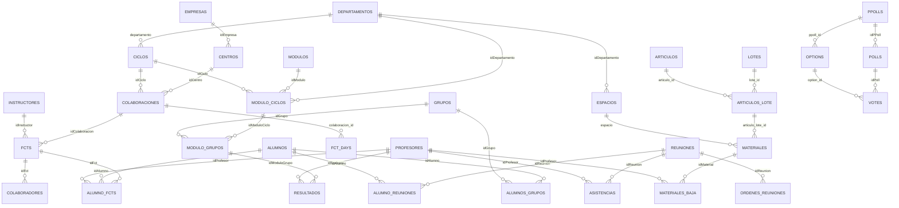

# Esquema de la BBDD

Document generat a partir de `database/schema/mysql-schema.sql`.

- Data de generacio: 2026-03-01 08:48:20 +0100
- Total de taules: 88
- Total de claus foranes: 93

## Esquema visual (simplificat)

Nota: diagrama simplificat per llegibilitat. El detall complet està en els apartats de taules i relacions d'este document.

## Taules

- `action_events`
- `actividad_grupo`
- `actividad_profesor`
- `actividades`
- `activities`
- `adjuntos`
- `alumno_fcts`
- `alumno_resultados`
- `alumno_reuniones`
- `alumnos`
- `alumnos_cursos`
- `alumnos_grupos`
- `alumnos_password_resets`
- `articulos`
- `articulos_lote`
- `asistencias`
- `autorizaciones`
- `bustia_violeta`
- `calendari_escolar`
- `centros`
- `centros_instructores`
- `ciclos`
- `colaboracion_votes`
- `colaboraciones`
- `colaboradores`
- `comision_fcts`
- `comisiones`
- `cotxe_accessos`
- `cotxes`
- `counters`
- `cursos`
- `departamentos`
- `documentos`
- `empresas`
- `espacios`
- `expedientes`
- `failed_jobs`
- `faltas`
- `faltas_itaca`
- `faltas_profesores`
- `fct_days`
- `fcts`
- `grupos`
- `grupos_trabajo`
- `guardias`
- `horarios`
- `horas`
- `incidencias`
- `instructores`
- `ipGuardias`
- `jobs`
- `lotes`
- `materiales`
- `materiales_baja`
- `menus`
- `miembros`
- `migrations`
- `modulo_ciclos`
- `modulo_grupos`
- `modulos`
- `municipios`
- `notifications`
- `ocupaciones`
- `options`
- `ordenes_reuniones`
- `ordenes_trabajo`
- `password_resets`
- `polls`
- `ppolls`
- `profesores`
- `profesores_password_resets`
- `programaciones`
- `projectes`
- `provincias`
- `reservas`
- `resultados`
- `reuniones`
- `settings`
- `signatures`
- `solicitudes`
- `tasks`
- `tasks_profesores`
- `tipo_actividad`
- `tipo_expedientes`
- `tipoincidencias`
- `tutorias`
- `tutorias_grupos`
- `votes`

## Relacions (FK)

- `actividad_grupo.idActividad` -> `actividades.id` ON DELETE CASCADE ON UPDATE CASCADE
- `actividad_grupo.idGrupo` -> `grupos.codigo` ON DELETE CASCADE ON UPDATE CASCADE
- `actividad_profesor.idActividad` -> `actividades.id` ON DELETE CASCADE ON UPDATE CASCADE
- `actividad_profesor.idProfesor` -> `profesores.dni` ON DELETE CASCADE ON UPDATE CASCADE
- `actividades.idDocumento` -> `documentos.id` ON DELETE SET NULL ON UPDATE CASCADE
- `actividades.tipo_actividad_id` -> `tipo_actividad.id` ON DELETE SET NULL
- `alumno_fcts.idAlumno` -> `alumnos.nia`
- `alumno_fcts.idFct` -> `fcts.id`
- `alumno_fcts.idProfesor` -> `profesores.dni` ON DELETE SET NULL ON UPDATE CASCADE
- `alumno_resultados.idAlumno` -> `alumnos.nia` ON DELETE CASCADE ON UPDATE CASCADE
- `alumno_resultados.idModuloGrupo` -> `modulo_grupos.id` ON DELETE CASCADE ON UPDATE CASCADE
- `alumno_reuniones.idAlumno` -> `alumnos.nia` ON DELETE CASCADE ON UPDATE CASCADE
- `alumno_reuniones.idReunion` -> `reuniones.id` ON DELETE CASCADE ON UPDATE CASCADE
- `alumnos_cursos.idAlumno` -> `alumnos.nia` ON DELETE CASCADE ON UPDATE CASCADE
- `alumnos_cursos.idCurso` -> `cursos.id` ON DELETE CASCADE ON UPDATE CASCADE
- `alumnos_grupos.idAlumno` -> `alumnos.nia` ON DELETE CASCADE ON UPDATE CASCADE
- `alumnos_grupos.idGrupo` -> `grupos.codigo` ON DELETE CASCADE ON UPDATE CASCADE
- `articulos_lote.articulo_id` -> `articulos.id` ON DELETE RESTRICT ON UPDATE CASCADE
- `articulos_lote.lote_id` -> `lotes.registre` ON DELETE CASCADE ON UPDATE CASCADE
- `asistencias.idProfesor` -> `profesores.dni` ON UPDATE CASCADE
- `asistencias.idReunion` -> `reuniones.id` ON DELETE CASCADE ON UPDATE CASCADE
- `autorizaciones.idActividad` -> `actividades.id` ON DELETE CASCADE ON UPDATE CASCADE
- `autorizaciones.idAlumno` -> `alumnos.nia` ON DELETE CASCADE ON UPDATE CASCADE
- `centros.idEmpresa` -> `empresas.id` ON DELETE CASCADE ON UPDATE CASCADE
- `centros_instructores.idCentro` -> `centros.id` ON DELETE CASCADE ON UPDATE CASCADE
- `centros_instructores.idInstructor` -> `instructores.dni` ON DELETE CASCADE ON UPDATE CASCADE
- `ciclos.departamento` -> `departamentos.id` ON UPDATE CASCADE
- `colaboracion_votes.idColaboracion` -> `colaboraciones.id` ON DELETE CASCADE ON UPDATE CASCADE
- `colaboracion_votes.option_id` -> `options.id` ON DELETE CASCADE ON UPDATE CASCADE
- `colaboraciones.idCentro` -> `centros.id` ON DELETE CASCADE ON UPDATE CASCADE
- `colaboraciones.idCiclo` -> `ciclos.id` ON DELETE CASCADE ON UPDATE CASCADE
- `colaboradores.idFct` -> `fcts.id` ON DELETE CASCADE ON UPDATE CASCADE
- `comision_fcts.idComision` -> `comisiones.id` ON DELETE CASCADE ON UPDATE CASCADE
- `comision_fcts.idFct` -> `fcts.id` ON DELETE CASCADE ON UPDATE CASCADE
- `comisiones.idDocumento` -> `documentos.id` ON DELETE SET NULL ON UPDATE CASCADE
- `comisiones.idProfesor` -> `profesores.dni` ON DELETE CASCADE
- `cotxes.idProfesor` -> `profesores.dni` ON DELETE CASCADE
- `espacios.idDepartamento` -> `departamentos.id` ON UPDATE CASCADE
- `expedientes.idAlumno` -> `alumnos.nia` ON UPDATE CASCADE
- `expedientes.idDocumento` -> `documentos.id` ON DELETE SET NULL ON UPDATE CASCADE
- `expedientes.idModulo` -> `modulos.codigo` ON UPDATE CASCADE
- `expedientes.idProfesor` -> `profesores.dni` ON UPDATE CASCADE
- `faltas.idDocumento` -> `documentos.id` ON DELETE SET NULL ON UPDATE CASCADE
- `faltas.idProfesor` -> `profesores.dni` ON DELETE CASCADE ON UPDATE CASCADE
- `faltas_itaca.idDocumento` -> `documentos.id` ON DELETE SET NULL ON UPDATE CASCADE
- `faltas_itaca.idGrupo` -> `grupos.codigo` ON DELETE CASCADE ON UPDATE CASCADE
- `faltas_itaca.idProfesor` -> `profesores.dni` ON DELETE CASCADE ON UPDATE CASCADE
- `faltas_profesores.idProfesor` -> `profesores.dni` ON DELETE CASCADE
- `fct_days.colaboracion_id` -> `colaboraciones.id` ON DELETE CASCADE
- `fcts.cotutor` -> `profesores.dni` ON DELETE CASCADE ON UPDATE CASCADE
- `fcts.idColaboracion` -> `colaboraciones.id` ON DELETE CASCADE ON UPDATE CASCADE
- `fcts.idInstructor` -> `instructores.dni` ON DELETE RESTRICT ON UPDATE CASCADE
- `guardias.idProfesor` -> `profesores.dni` ON DELETE CASCADE ON UPDATE CASCADE
- `incidencias.espacio` -> `espacios.aula` ON DELETE CASCADE ON UPDATE CASCADE
- `incidencias.idProfesor` -> `profesores.dni` ON UPDATE CASCADE
- `incidencias.orden` -> `ordenes_trabajo.id` ON DELETE SET NULL ON UPDATE CASCADE
- `incidencias.tipo` -> `tipoincidencias.id` ON UPDATE CASCADE
- `lotes.departamento_id` -> `departamentos.id` ON DELETE SET NULL ON UPDATE CASCADE
- `materiales.articulo_lote_id` -> `articulos_lote.id` ON DELETE CASCADE ON UPDATE CASCADE
- `materiales.espacio` -> `espacios.aula` ON UPDATE CASCADE
- `materiales_baja.idMaterial` -> `materiales.id` ON DELETE CASCADE ON UPDATE CASCADE
- `materiales_baja.idProfesor` -> `profesores.dni` ON UPDATE CASCADE
- `miembros.idGrupoTrabajo` -> `grupos_trabajo.id` ON DELETE CASCADE ON UPDATE CASCADE
- `miembros.idProfesor` -> `profesores.dni` ON UPDATE CASCADE
- `modulo_ciclos.idCiclo` -> `ciclos.id` ON UPDATE CASCADE
- `modulo_ciclos.idDepartamento` -> `departamentos.id` ON DELETE CASCADE ON UPDATE CASCADE
- `modulo_ciclos.idModulo` -> `modulos.codigo` ON DELETE CASCADE ON UPDATE CASCADE
- `modulo_grupos.idGrupo` -> `grupos.codigo` ON DELETE CASCADE ON UPDATE CASCADE
- `modulo_grupos.idModuloCiclo` -> `modulo_ciclos.id` ON DELETE CASCADE ON UPDATE CASCADE
- `options.ppoll_id` -> `ppolls.id` ON DELETE CASCADE ON UPDATE CASCADE
- `ordenes_reuniones.idReunion` -> `reuniones.id` ON DELETE CASCADE ON UPDATE CASCADE
- `ordenes_trabajo.idProfesor` -> `profesores.dni` ON DELETE SET NULL ON UPDATE CASCADE
- `polls.idPPoll` -> `ppolls.id` ON DELETE CASCADE ON UPDATE CASCADE
- `programaciones.idModuloCiclo` -> `modulo_ciclos.id` ON DELETE CASCADE ON UPDATE CASCADE
- `projectes.idProfesor` -> `profesores.dni` ON DELETE SET NULL
- `reservas.idEspacio` -> `espacios.aula` ON DELETE CASCADE ON UPDATE CASCADE
- `reservas.idProfesor` -> `profesores.dni` ON DELETE CASCADE ON UPDATE CASCADE
- `resultados.idModuloGrupo` -> `modulo_grupos.id` ON DELETE CASCADE ON UPDATE CASCADE
- `resultados.idProfesor` -> `profesores.dni` ON UPDATE CASCADE
- `reuniones.idProfesor` -> `profesores.dni` ON UPDATE CASCADE
- `signatures.idProfesor` -> `profesores.dni` ON DELETE CASCADE ON UPDATE CASCADE
- `signatures.idSao` -> `alumno_fcts.idSao` ON DELETE CASCADE ON UPDATE CASCADE
- `solicitudes.idAlumno` -> `alumnos.nia` ON UPDATE CASCADE
- `solicitudes.idOrientador` -> `profesores.dni` ON UPDATE CASCADE
- `solicitudes.idProfesor` -> `profesores.dni` ON UPDATE CASCADE
- `tasks_profesores.id_profesor` -> `profesores.dni` ON DELETE CASCADE ON UPDATE CASCADE
- `tasks_profesores.id_task` -> `tasks.id` ON DELETE CASCADE ON UPDATE CASCADE
- `tipo_actividad.departamento_id` -> `departamentos.id` ON DELETE RESTRICT
- `tipoincidencias.idProfesor` -> `profesores.dni` ON DELETE CASCADE
- `tutorias_grupos.idGrupo` -> `grupos.codigo` ON DELETE CASCADE ON UPDATE CASCADE
- `tutorias_grupos.idTutoria` -> `tutorias.id` ON DELETE CASCADE ON UPDATE CASCADE
- `votes.idPoll` -> `polls.id` ON DELETE CASCADE ON UPDATE CASCADE
- `votes.option_id` -> `options.id`
