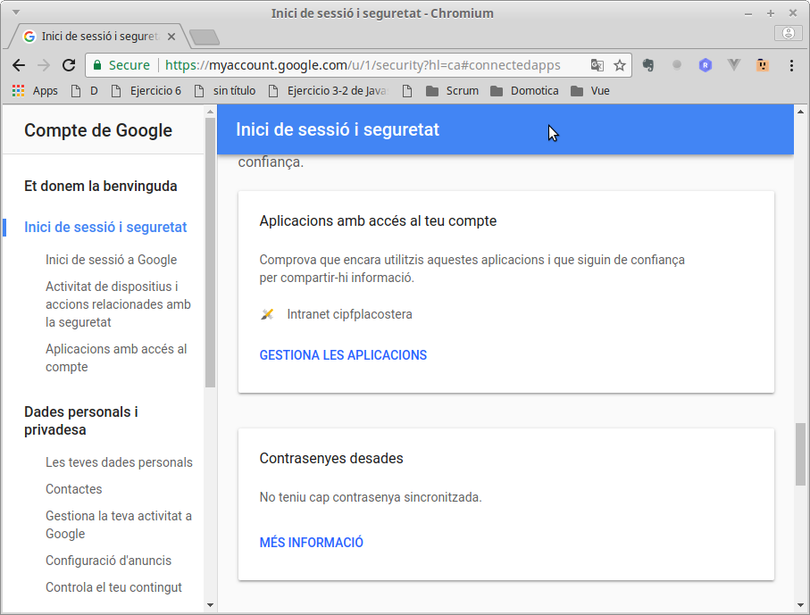

# Desplegar la intranet en una nova màquina
Instal·lem el sistema operatiu, preferiblemente sense entorn gràfic. La versió de PHP ha de ser al menys la 7.2, encara que és preferible tindre la 8.1 o superior.

## Preparació
### Instal·lar el software
Els paquets a instal·lar són:

* **php**
* **phpmyadmin**
* **git**
* **composer**
* **apache2**
* **mysql-server** o **mariadb-server**

Hem de donar accéss a l'usuari `root` a MySql, encara que es recomana crear un usuari per a la BBDD de la intranet y utilitzar aquest usuari y no root (però podem fer-ho després des del **phpmyadmin**). Farem:
```bash
sudo mysql -u root

mysql> USE mysql;
mysql> ALTER USER 'root'@'localhost' IDENTIFIED WITH mysql_native_password BY 'P@ssw0rd';
mysql> FLUSH PRIVILEGES;
mysql> exit;

sudo systemctl restart mysql.service    # o mariadb.service
```

### Crear la BBDD
Crearem la BBDD per a la nostra intranet. Podem fer-ho del del phpmyadmin o des de la CLI. Es recomana crear un usuari per a gestionar aquesta base de dades.

### Descarregar la aplicació
Dins de `/var/www/html` clonem el repositori de la intranet:

```bash
git clone git@github.com:cipfpbatoi/intranetBatoi.git
```

En el moment d'escriure aquesta ajuda hauríem de utilitzar la branca `laravel10` perquè `master` encara no està actualitzada. EN el futur es farà directament des de la branca _master_.

### Configurar apache
Creem els certificats (el _.key_ en `/etc/ssl/private` i els altres 2 en en `/etc/ssl/certs`):
```bash
openssl genrsa -out intranet.key 2048
openssl req -new -key intranet.key -out intranet.csr   # completem la informació que ens demanen
openssl x509 -req -in intranet.csr -signkey intranet.key -out intranet.crt
```

Configurem el lloc web SSL en _/etc/apache2/sites-available_:
* ServerName: p.ej. `ServerName intranet.my`
* DocumentRoot: `DocumentRoot /var/www/html/intranetBatoi/public`
* SSLCertificateFile: `SSLCertificateFile /etc/ssl/certs/intranet.crt`
* SSLCertificateKeyFile: `SSLCertificateKeyFile /etc/ssl/certs/intranet.key`
* Creem un nou directori:`
```bash
<Directory /var/www/html/intranetBatoi/public>
  AllowOverride All
  Order Allow,Deny
  Allow from All
</Directory>
```

Configurem el lloc web no SSL en _/etc/apache2/sites-available_ per a que redireccione al SSL:
* ServerName: p.ej. `ServerName intranet.my`
* Redireccionem: `Redirect permanent  /  https://intranet.my/`
* DocumentRoot: `DocumentRoot /var/www/html/intranetBatoi/public`

Habilitem els sites si els hem creat nous:
```bash
sudo a2ensite intranet.conf
sudo a2ensite intranet-ssl.conf
```

Configurem el **php.ini** (en _/etc/php/8.x/apache2/_) per a poder subir els fitxers de Itaca que són molt grans. També és convenient indicar la hora local:
```bash
post_max_size=0
upload_max_filesize = 200M
date.timezone = Europe/Madrid
```

Posem el nostre domini en el **/etc/hosts**:
```bash
127.0.0.1   intranet.my
```

Per a finalitzar hem d'activar (si no ho estan ja) els mòduls **ssl** i **rewrite** i reiniciar apache:
```bash
sudo a2enmod ssl
sudo a2enmod rewrite
sudo systemctl restart apache2.service
```
ATENCIÓ: cal que estiga la carpeta intranetBatoi ja creada abans de reiniciar Apache per que no done un error.

## Initzialitzar l'aplicació
Creem el fitxer `.env` amb les dades de la nostra intranet. Utilitzem como plantilla el fitxer `.env.dusk.local`:
```bash
cp .env.dusk.local .env
```

I editem el fitxer _`.env`_ modificant les variables:
```bash
- `APP_KEY`: haurà de contener la clave generada con php artisan key:generate (ho farem després automàticament)
- `APP_URL`: URL de la nostra intranet, ej. `http://intranet.my`
- `DB_DATABASE`: ponemos el nombre de nuestra BBDD
- `DB_USERNAME`, `DB_PASSWORD`: el usuario y contraseña para acceder a la misma
- `SESSION_DOMAIN`: URL de la nostra intranet (com la APP_URL però sense http), ej. `intranet.my`
```

composer update
Si falta algo hay que instalarlo, p.ej. si dice que falta ext-bcmath hay que instalar php8.1-bcmath

migrete
db:seeder

mv public/img/pdf.exemple/ a pdf/

iniciar con admin@intranet.my y 12345678

## Instal·lar el servidor de correu
Instal·lem el servidor de correu **exim4** y després el configurem:
```bash
sudo apt install exim4
sudo dpkg-reconfigure exim4-config
```

El que ens pregunta és:
* General type of mail configuration: _mail sent by smarthost: received via SMTP of fetchmail_
* System mail name: _intranet.my_ (o el nom que haguem donat al domini en .env)
* IP-addresses to listen on for incoming SMTP connections: _127.0.0.1 ; ::1_
* Other destinations for which mail is accepted: buit
* Machines to relay mail for: buit
* IP address or host name of the outgoing smarthost: _smtp.gmail.com::587_
* Hide local mail name in outgoing mail? _No_
* Keep number of DNS-queries minimal (Dial-on-Demand)? _No_
* Delivery method for local mail: _mbox format in /var/mail/_
* Split configuration into small files? _No_
* Root and Postmaster mail recipient: buit

A continuació editem el fitxer **/etc/exim4/passwd.client** per posar el nom i contrasenay del compte de gmail a utilitzar per a enviar els correus:
```bash
### target.mail.server.example:login:password
gmail-smtp.l.google.com:intranet@gmail.com:abcd@1234
*.google.com:intranet@gmail.com:abcd@1234
smtp.gmail.com:intranet@gmail.com:abcd@1234
```

Per a finalitzar hem de configurar el compte de GMail per a permetre a exim eixir. Es fa des de **GMail -> Configuració -> Compte -> Configuració del compte de Google -> Inici de sessió i seguretat -> Aplicacions amb accés al compte -> Permet l'accés a les aplicacions menys segures** i ACTIVEM aquesta opció:



Podem conprovar que funciona correctament enviant un e-mail des de la terminal:
```bash
mail el_meu_micorreu@gmail.com
```

També cal possar en el crontab:

* 21,22,23,5,6,7,8 * * 1-5 php /var/www/html/IntranetBatoi/artisan schedule:run >> /var/www/html/IntranetBatoi/schedule.log  2>&1
00 01 * * * rm /var/www/html/IntranetBatoi/storage/tmp/*
*/1 * * * * php /var/www/html/IntranetBatoi/artisan queue:work --once --timeout=120 --tries=3

Si estem gastant https:: no funcionaran els pdf por el snapy. Cal mirar la documentació d'esta pàgina per resoldre el bug
https://github.com/barryvdh/laravel-snappy/issues/217. Depenent de la versió de linux que hem instal·lat variarà. Es tracta de degradar el ssl.

