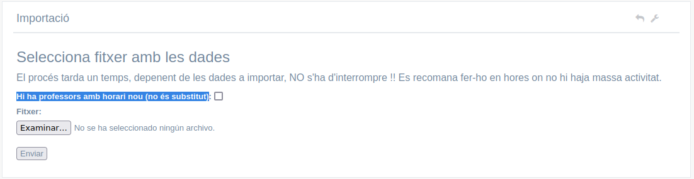

# Desplegar la intranet en una nova màquina
- [Desplegar la intranet en una nova màquina](#desplegar-la-intranet-en-una-nova-màquina)
  - [Introducció](#introducció)
  - [Instal·lar el programari](#installar-el-programari)
    - [Configurar MySQL](#configurar-mysql)
    - [Crear la BBDD](#crear-la-bbdd)
    - [Descarregar la aplicació](#descarregar-la-aplicació)
    - [Configurar Apache](#configurar-apache)
  - [Initzialitzar l'aplicació](#initzialitzar-laplicació)
  - [Importar dades de Itaca](#importar-dades-de-itaca)
    - [Primera importació](#primera-importació)
    - [Resta d'importacions](#resta-dimportacions)
  - [Instal·lar el servidor de correu](#installar-el-servidor-de-correu)


## Introducció
Ací es detalla com configurar el servidor per a la intranet. En aquesta màquina instal·lem el sistema operatiu, preferiblemente sense entorn gràfic. La versió de PHP ha de ser al menys la 7.2, encara que és preferible tindre la 8.

## Instal·lar el programari
Els paquets a instal·lar són:

* **git** apt-get install git
* **extension de php** apt-get install install php-zip php-dom php-mbstring php-json
* **composer** (https://getcomposer.org)
* **libxrender1, libxtst6 i libssl1.0-dev** (per a poder generar PDFs)
* **phpmyadmin**
* **apache2** 
* **mysql-server** o **mariadb-server**

### Configurar MySQL
Hem de donar accéss a l'usuari `root` a MySql, encara que es recomana crear un usuari per a la BBDD de la intranet y utilitzar aquest usuari y no root (però podem fer-ho després des del **phpmyadmin**). Farem:
```bash
sudo mysql -u root

mysql> USE mysql;
mysql> ALTER USER 'root'@'localhost' IDENTIFIED WITH mysql_native_password BY 'P@ssw0rd';
mysql> FLUSH PRIVILEGES;
mysql> exit;

sudo systemctl restart mysql.service    # o mariadb.service
```

### Crear la BBDD
Crearem la BBDD per a la nostra intranet. Podem fer-ho del del phpmyadmin o des de la CLI. Es recomana crear un usuari per a gestionar aquesta base de dades.

### Descarregar la aplicació
Dins de `/var/www/html` clonem el repositori de la intranet:

```bash
git clone git@github.com:cipfpbatoi/intranetBatoi.git
```

En el moment d'escriure aquesta ajuda hauríem de utilitzar la branca `laravel10` perquè `master` encara no està actualitzada. En el futur es farà directament des de la branca _master_.

### Configurar Apache
Creem els certificats (el _.key_ en `/etc/ssl/private` i els altres 2 en en `/etc/ssl/certs`):
```bash
openssl genrsa -out intranet.key 2048
openssl req -new -key intranet.key -out intranet.csr   # completem la informació que ens demanen
openssl x509 -req -in intranet.csr -signkey intranet.key -out intranet.crt
```

Configurem el lloc web SSL en _/etc/apache2/sites-available_:
* ServerName: p.ej. `ServerName intranet.my`
* DocumentRoot: `DocumentRoot /var/www/html/intranetBatoi/public`
* SSLCertificateFile: `SSLCertificateFile /etc/ssl/certs/intranet.crt`
* SSLCertificateKeyFile: `SSLCertificateKeyFile /etc/ssl/certs/intranet.key`
* Creem un nou directori:`
```bash
<Directory /var/www/html/intranetBatoi/public>
  AllowOverride All
  Order Allow,Deny
  Allow from All
</Directory>
```

Configurem el lloc web no SSL en _/etc/apache2/sites-available_ per a que redireccione al SSL:
* ServerName: p.ej. `ServerName intranet.my`
* Redireccionem: `Redirect permanent  /  https://intranet.my/`
* DocumentRoot: `DocumentRoot /var/www/html/intranetBatoi/public`

Habilitem els sites si els hem creat nous:
```bash
sudo a2ensite intranet.conf
sudo a2ensite intranet-ssl.conf
```

Configurem el **php.ini** (en _/etc/php/8.x/apache2/_) per a poder subir els fitxers de Itaca que són molt grans. També és convenient indicar la hora local:
```bash
post_max_size=0
upload_max_filesize = 200M
date.timezone = Europe/Madrid
```

Posem el nostre domini en el **/etc/hosts**:
```bash
127.0.0.1   intranet.my
```

Per a finalitzar hem d'activar (si no ho estan ja) els mòduls **ssl** i **rewrite** i reiniciar apache:
```bash
sudo a2enmod ssl
sudo a2enmod rewrite
sudo systemctl restart apache2.service
```
ATENCIÓ: cal que estiga la carpeta intranetBatoi ja creada abans de reiniciar Apache per que no done un error.

## Initzialitzar l'aplicació
Creem el fitxer `.env` amb les dades de la nostra intranet. Utilitzem como plantilla el fitxer `.env.example`:
```bash
cp .env.example .env
```

I editem el fitxer _`.env`_ modificant les variables:
```bash
- `APP_URL`: URL de la nostra intranet, ej. `http://intranet.my`
- `DB_DATABASE`: ponemos el nombre de nuestra BBDD
- `DB_USERNAME`, `DB_PASSWORD`: el usuario y contraseña para acceder a la misma
- `SESSION_DOMAIN`: URL de la nostra intranet (com la APP_URL però sense http), ej. `intranet.my`
```

Ara ja podem instal·lar les dependències amb el comando:
```bash
composer update
```
Si falla perquè falta algun paquet l'haurem d'instal·lar. Per exemple en aquesta versió diu que falta `ext-bcmath`. Com que la nostra versió de PHP és la 8.1 haurem d'executar `apt install php8.1-bcmath`.

Creem la clau que es guardarà en el fitxer `.env` amb: 
```bash
php artisan key:generate      # Genera la clave de la aplicación y la añade a APP_KEY en el fichero .env
```

Ara hem de recarregar el fitxer de configuració en la caché (cal fer-ho cada vegada que canviem alguna cosa en qualsevl fitxer de configuració):
```bash
php artisan config:cache
```

Per últim només queda crear les taules de la BBDD i carregar-les amb les dades inicials. Ho fem amb:
```bash
php artisan migrate     # crea las tablas en la base de datos
php artisan db:seed     # inserta los datos iniciales de algunas tablas
```

El `db:seed` fica les dades inicials de:
* menu:
* ciclos:
* horas:
* departamentos:
* tipoincidencias:
* settings:
* ipguardias:

Les dades de les taules de _muninipios_ i _provincias_ no els obtenim de Itaca sinó que els hem de importar a ma si els volem (és opcional, s'utilitzen només en alguns llistats).

També crea un usuari amb el codi 9999 i la contrasenya '12345678' que és Administrador provisional de la intranet. Per a iniciar sessió per primera vegada hem de posar com usuari el seu email què és `admin@intranet.my`.

A continuació canviem el nom de la carpeta `pdf.exemple` a `pdf` amb
```bash
mv public/img/pdf.exemple/ a pdf/
```

Ara canviem el propietari de la carpeta de la intranet i el seu contingut a l'usuari **www-data** i donem permisos d'escriptura per a tothom sobre la carpeta `/storage` y el seu contingut.
```bash
chown -R www-data:www-data .
chmod -R a+w ./storage
```

## Importar dades de Itaca
Abans de fer la primera importació de dades de Itaca hem d'obrir el fitxer **contacto.php** en _/config_ on configurem totes les dades del nostre centre. A més indicarem el NIF (en format Itaca, és a dir, amb un 0 davant) dels càrrecs així com:
* avisos -> material: la persona que indiquen rebrà un misstage cada vegada que es canvia d'ubicació un material inventariable
* incidències: ací posem a totes les persones que s'encarreguen de solventar incidències en el Centre. Són els usuaris a qui es pot asignar una incidència quan es crea.

També és convenient posar correctament les dades de les taules (això només cal fer-ho la primera vegada que es crea la intranet, la resta d'anys es conserven les dades):
* Departamentos
* Ciclos

La taula _Departamentos_ ha de tindre OBLIGATORIAMENT un departament (podem dir-li 'Desconegut' o com vulgam) amb **codi 99** que és al que s'asignaran els nous professors fins que es posen en el departament adequat.

### Primera importació
En el xml de Itaca per a la primera importació han d'estar les següents taules:
* Continguts (mòduls del centre)
* Ocupacions (codis de les ocupacions no lectives dels professors)
* Grups (grups del centre)
* Professors
* Alumnes
* Horaris grup (horaris lectius dels diferents grups)
* Horaris ocupacions (horaris no lectius dels profsesores)

Les importacions es fan des del menú **Administració -> Importació des de Itaca**. Al ser la primera cal marcar la casella '_Hi ha professors amb horari nou (no és substitut)_'.



A continuació seleccionen el fitxer amb les dades en format .XML i polsem 'Enviar'.

**ATENCIÓ: Aquest procés tardarà uns quants minuts en funció de la mida del fitxer XML. És molt important _NO TANCAR_ el navegador ni tornar a polsar '_Enviar_' fins que acabe**.

Tras importar les dades la primera vegada hurem d'assignar a ma **els professores als departaments** i **els grups als cicles** (posteriorment només haurem de tornar-ho a fer amb elo nous professors i els nous grups si hi haguera tras cada importació).

Els professors estan asignats per defecte al departament 99 ('Desconegut'). Cada professor pot posar el departament al que pertany editant el seu perfil. També des de direcció es pot posar cadascun al seu departament des de **Equip directiu -> Dades professors -> Editar perfil professor**.

Els grups por defecte no estan asignats a cap cicle. Per a fer-ho anem a **Professorat -> Gestió grups -> Editar grup** i li posem a cada grup el seu cicle.

Per a finalitzar hem de tornar a fer la importació per a que s'asignen correctament els mòduls als cicles al importar els horaris **sense la casella de 'Hi ha professors amb horari nou' MARCADA.

### Resta d'importacions
En el xml de Itaca per a la resta d'importacions només estaran les taules en que hi haja canvis, normalment:
* Alumnes per a reflectir les noves matrículas i baixes
* Profesores, si hi ha nous professors
* Horaris grup i horaris ocupacions, si hi hagueren canvis

Si hi ha algun professor nou que **no és substitut** d'altre que ja estava hem de marcar la caselle '_Hi ha professors amb horari nou_'.

Marquem 'Assignar tutor' si hi ha nous tutors (si no, no cal) i deixem desmarcada la d'esborrar grups sense tutor.


## Instal·lar el servidor de correu
Necessitem un servidor de correu instal·lat per a moltes de les funcionalitats de la intranet. Ací teniu com exemple la instal·lació i configuració del servidor de correu **exim4** amb un compte de Gmail, però es pot utilitzar qualsevol.

El primer pas és instal·lar el paquet i configurar-lo:
```bash
sudo apt install exim4
sudo dpkg-reconfigure exim4-config
```

El que ens pregunta és:
* General type of mail configuration: _mail sent by smarthost: received via SMTP of fetchmail_
* System mail name: _intranet.my_ (o el nom que haguem donat al domini en .env)
* IP-addresses to listen on for incoming SMTP connections: _127.0.0.1 ; ::1_
* Other destinations for which mail is accepted: buit
* Machines to relay mail for: buit
* IP address or host name of the outgoing smarthost: _smtp.gmail.com::587_
* Hide local mail name in outgoing mail? _No_
* Keep number of DNS-queries minimal (Dial-on-Demand)? _No_
* Delivery method for local mail: _mbox format in /var/mail/_
* Split configuration into small files? _No_
* Root and Postmaster mail recipient: buit

A continuació editem el fitxer **/etc/exim4/passwd.client** per posar el nom i contrasenay del compte de gmail a utilitzar per a enviar els correus:
```bash
### target.mail.server.example:login:password
gmail-smtp.l.google.com:intranet@gmail.com:abcd@1234
*.google.com:intranet@gmail.com:abcd@1234
smtp.gmail.com:intranet@gmail.com:abcd@1234
```

Per a finalitzar hem de configurar el compte de GMail per a permetre a exim eixir. Es fa des de **GMail -> Configuració -> Compte -> Configuració del compte de Google -> Inici de sessió i seguretat -> Aplicacions amb accés al compte -> Permet l'accés a les aplicacions menys segures** i ACTIVEM aquesta opció:


Podem conprovar que funciona correctament enviant un e-mail des de la terminal:
```bash
mail el_meu_micorreu@gmail.com
```

També cal possar en el crontab:

* 21,22,23,5,6,7,8 * * 1-5 php /var/www/html/IntranetBatoi/artisan schedule:run >> /var/www/html/IntranetBatoi/schedule.log  2>&1
00 01 * * * rm /var/www/html/IntranetBatoi/storage/tmp/*
*/1 * * * * php /var/www/html/IntranetBatoi/artisan queue:work --once --timeout=120 --tries=3

Si estem gastant _https_ no funcionaran els pdf por el snapy. Cal mirar la documentació d'esta pàgina per resoldre el bug
https://github.com/barryvdh/laravel-snappy/issues/217. Depenent de la versió de linux que hem instal·lat variarà. Es tracta de degradar el ssl.

