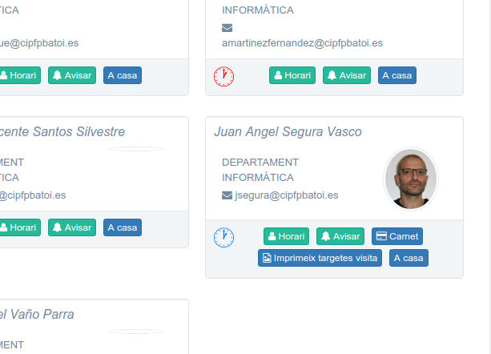
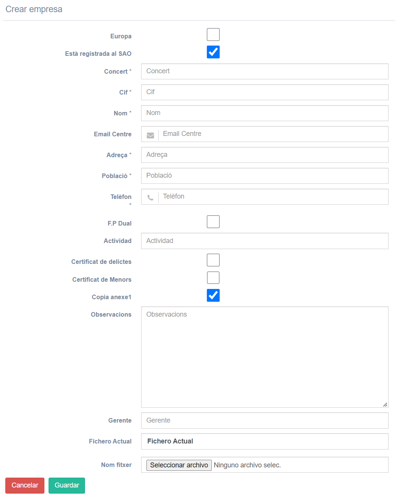
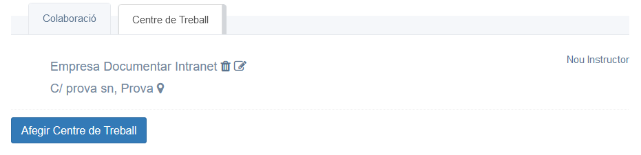
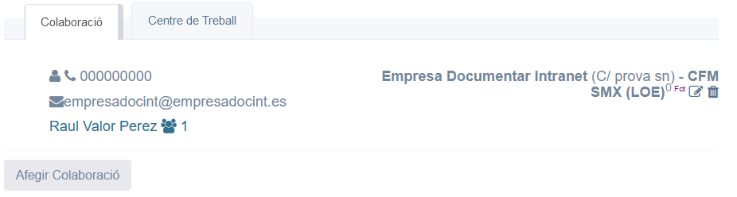
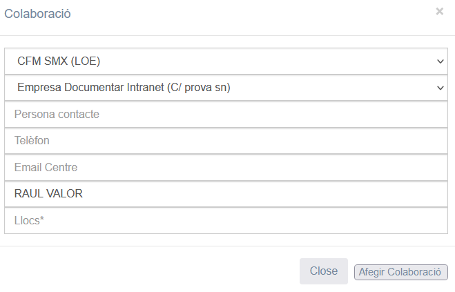
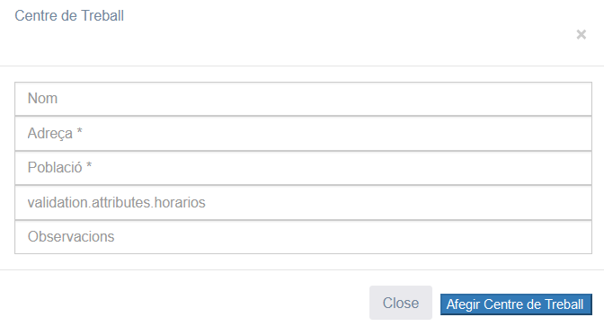
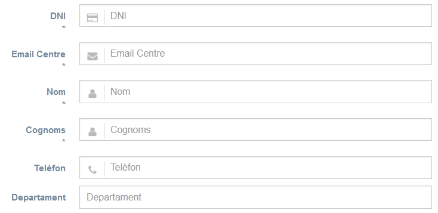

# Preguntes freqüents
Ací trobem informació de còm fer coses concretes com:
* Professor
  * [Fitxar](#com-fitxar-lentrada-o-eixida-del-centre)
  * [Fitxar una guàrdia](#com-fitxar-una-gu%C3%A0rdia)
  * [Localitzar a algú](#com-localitzar-a-un-professor-o-a-direcci%C3%B3)
  * [Contactar amb algú](#com-contactar-amb-un-professor)
  * [Fer una Activitat extraescolar](#com-fer-una-activitat-extraescolar)
  * [Fer una Comissió de Servei](#com-fer-una-comissi%C3%B3-de-servei)
  * [Reservar un aula](#com-reservar-un-aula-o-el-sal%C3%B3-dactes)
  * [Notificar una absència](#com-notificar-una-abs%C3%A8ncia)
  * [Informar d'alguna incidència](#com-informar-dalgun-problema-o-incid%C3%A8ncia)
  * [Consultar les propostes de millora de l'any anterior per a fer la programació d'un mòdul](#com-consultar-les-propostes-de-millora-per-a-fer-la-meua-programaci%C3%B3)
  * [Enviar la meua programació al Cap de Departament](#com-enviar-la-meua-programaci%C3%B3)
  * [Buscar una programació o altre document](#com-buscar-una-programaci%C3%B3-o-altra-documentaci%C3%B3)
  * [Fer el seguiment de la programació](#com-fer-el-seguiment-de-la-programaci%C3%B3)
  * [Imprimir el meu carnet](#com-imprimir-el-meu-carnet-de-professor)
* Tutor
  * [Fer un Acta (d'avaluació, ...)](#com-fer-un-acta-davaluaci%C3%B3-o-daltre-tipus)
  * [Imprimir el carnet dels alumnes](#com-imprimir-els-carnets-dels-alumnes)
* Altres
  * [Fer l'inventari](#com-fer-linventari)
* FCT
  * [Com anyadir una empresa que no ha colaborat abans amb el centre](#com-anyadir-una-empresa-que-no-ha-colaborat-abans-amb-el-centre)
  * [Com crear una col.laboració amb el departament](#com-crear-una-nova-collaboració-amb-el-departament)
  * [Com crear un nou instructor o un nou centre de treball](#com-crear-un-nou-instructor-o-un-nou-centre-de-treball)
  * [Entrada prova 1](#entrada-nova-2)
  

## Com Fitxar l'entrada o eixida del Centre
Al arribar al Centre hem de fitxar a la Intranet. Podem fer-ho de 3 formes diferents:
1. El més senzill és des del nostre mòbil amb la icona que hem rebut
2. També podem fer-ho des de l'ordinador que hi ha en Consergeria introduint el nostre codi de professors (4 cifres)
3. Es fa automàticament al iniciar sessió en la Intranet

Per a fitxar la nostra eixida del Centre podem fer-ho exactament igual (des del mòbil, l'ordinador de Consergeria o la Intranet). Per a fer-ho des de la Intranet només hem de [polsar el rellotge blau](./manual-profe.md#control-de-presència) que hi ha en la part superior dreta

## Com Fitxar una guàrdia
Cada vegada que fem una guàrdia hem de fitxar que estem fent-la. Només es pot fer durant l'hora de la guàrdia i des de l'ordinador de la Biblioteca (si és guàrdia de biblioteca) o des de un dels ordinadors de la Sala de profes (si és guàrdia normal).

Si per algun motiu no fem la guàrdia la fitxarem després des de qualsevol equip però com no feta (no ens deixarà marcar-la com feta) i en els comentaris indicarem el motiu pel qual no l'hem feta. Això **NO cal fer-ho** si estem d'activitat extraescolar, comissió de servei o si hem notificat prèviament la nostra absència des de la intranet (en aquestos casos ja ens apareixerà marcada com no feta i omplit el comentari amb el motiu).

Les guàrdies el fitxen des del [menú Docència->Guàrdia](./manual-profe.md#guàrdia).

## Com Localitzar a un professor o a algú de Direcció
Per a localitzar a qualsevol professor anem al [menú Docència->Claustre](./manual-profe.md#claustre) i el busquem dins del seu departement.

En cas de algú de direcció anem al [menú Docència->Equip directiu](./manual-profe.md#equip-directiu) on trobem la mateixa informació però de la gent de Direcció.

## Com Contactar amb un professor
Per a contactar amb qualsevol professor anem al [menú Docència->Claustre](./manual-profe.md#claustre) i el busquem en el seu departement. Allí podem veure on està ara, el seu email i el seu telèfon (si no ho ha marcat com ocult). A més de enviar-li un e-mail podem enviar-li una notificació de la Intranet des del botó 'Avisar'. 

Recorda que **totes les notificacions no vistes** en el dia se li envien a l'usuari automàticament en un e-mail remitit per la Intranet.

## Com fer una Activitat extraescolar
Es fa des del [menú Tràmits->Activitats Extraescolars](./manual-profe.md#activitats-extraescolars). Els pasos a seguir són:
1. Donar d'alta la nova activitat des del botó '**Alta activitat**' (botó blau a la part superior). Hem d'indicar els professors participants i els grups d'alumnes en els que es fa l'activitat
2. Una vegada feta, des de la taula d'activitats hem de polsar el botó de '**Enviar per a autoritzar**' per a que li arribe a Direcció l'activitat. Allí ens la han d'aprovar
3. Una vegada aprovada per part de direcció polsem el botó de '**Avisar al professorat**'. Rebran una notificació informant d'aquesta activitat tot el professorat que participa en ella i tots els que imparteixen clase en els grups que participen en l'activitat
4. Botó de '**Imprimir autorització de menors**': obri un PDF amb l'autorització per als menors d'edat. Hem de donar-li-la a cadascún d'ells i han de portar-la signada pels pares per a poder participar en eixa activitat

## Com fer una Comissió de servei
Si hem de fer una visita (per FCT, activitat extraescolar o altre motiu), un viatge, etc. fora del Centre hem de registrar una Comissió de servei. Això ens permet estar assegurats fora del Centre i poder cobrar posterioment els gastos de desplaçament o altres que tingam.

Es fa des del [menú Tràmits->Comissions de Servei](./manual-profe.html#comisions-de-servei). Els pasos a seguir són:
1. Donar d'alta la nova comissió des del botó '**Sol·licitut autorització comissió de servei**' (botó blau a la part superior). Hem d'indicar la data, el motiu i els gastos de quilometratge i altres que esperem tindre.
2. Una vegada feta, des de la taula de comissions hem de polsar el botó de '**Enviar per a autoritzar**' per a que li arribe a Direcció la comissió. Allí ens l'han d'aprovar
3. Una vegada aprovada per part de direcció polsem el botó de '**Avisar al professorat**'. Rebran una notificació els nostres companys d'equip educatiu per a que sàpien que no estarem en clase a eixes hores
4. Per últim polsem el botó de '**Cobrar comissió**' (només per a les Registrades). Això posa l'estat de la comissió com '_Pendent de cobrament_' el que indica a la Secretària que ens ha de fer el taló per a cobrar aquesta comissió. En el cas de FCT no ens faran un taló per cada comissió sinò que les agruparan.

## Com Reservar un aula o el Saló d'Actes
Si necessitem un espai diferent a la nostra aula (per exemple el Saló d'actes per a fer una xarrada o un aula per a fer un exàmen) hem de reservar-lo per a assegurar que el tindrem eixe dia.

Es fa des del [menú Tràmits->Reserva aules](./manual-profe.md#reserva-aules).

## Com Notificar una absència
NOTA: no cal notificar una absència si és per una activitat extraescolar o comissió de servei perquè ja es registra al crear l'activitat o la comissió.

Si sabem amb antelació que faltarem un dia o unes hores (perque tenim consulta mèdica o per qualsevol altre motiu) **abans d'eixe dia** notificarem la nostra absència i així tant Direcció com els nostres companys d'equip educatiu ho sabran per a poder organitzar les classes amb els nostres alumnes. 

Si la nostra absència ha segut inesperada (per malaltia o altre motiu) aquest procès el farem quan siga possible.

Es fa des del [menú Tràmits->Notificació Absències](./manual-profe.md#notificació-absències). Els pasos a seguir són:
1. Donar d'alta l'absència des del botó '**Comunicació d'absència professorat**' (botó blau a la part superior). Hem d'indicar la data, el motiu i el justificant (podem escanejar-lo o fer-li una foto amb el mòbil i obrir allí la Intranet). Si encara no tenim el justificant l'adjuntarem quan el tingam modificant aquesta absència. Es crea el registre i el seu estat serà '**No enviada/autoritzada**'.
2. Una vegada feta, des de la taula d'absències hem de polsar el botó de '**Enviar**' per a que li arribe a Direcció. Si no hem adjuntat el justificant el seu estat serà '**Sense justificant**'. Si ho hem adjuntat l'estat serà '**Justificada**'.
3. Polsem el botó de '**Avisar equip**' per a que rebran una notificació els nostres companys d'equip educatiu per a que sàpien que no estarem en clase a eixes hores
3. En el moment que tinguem el justificant polsem el botó de '**Modificació absència**' i l'adjuntem. Si és un papel podem escanejar-lo o fer-li una foto amb el mòbil i obrir la Intranet en el nostre mòbil per a adjuntar-la
3. Quan la absència estiga justificada la aprovaran des de direcció i el seu estat pasa a ser '**Resolta**'

## Com Informar d'algun problema o incidència
La gestió d'incidències de la Intranet se utilitza per a informar de:
- qualsevol problema amb les instal·lacions o l'equipament tant de l'aula com dels espais comuns
- problemes informàtics
- problemes amb la Intranet
- el procès de la FCT
- queixes i sugerències

Es fa des del [menú Tràmits->Gestió Incidències](./manual-profe.md#gestió-dincidències).

## Com consultar les propostes de millora per a fer la meua Programació
Un dels punts que hem d'incloure en la Programació és reflectir les propostes de millora anotats en el seguiment de la programació pels professors que van impartir aquest mòdul el curs anterior.

Aquesta informació la trobem en la intranet en [menú Docència->Programacions](./manual-profe.md#programacions). Allí ens apareixen totes les programacions dels mòduls que impartim i l'última icona que tenim en cadascuna és la de 'Omplir seguiment de la programació' (uns binoculars). Des d'alli omplirem el seguiment al final de cada avaluació però al principi de curs trobem les propostes de millora del curs anterior.

## Com enviar la meua Programació
Les programacions es guarden en el _Google Drive_ del Centre. Podem accedir a les nostres des de la intranet en [menú Docència->Programacions](./manual-profe.md#programacions) (només dins del Centre) o desde casa amb l'enllaç que ens han enviat per e-mail des de Caporalia.

Les programacions han de **modificar-se en Google Drive, no descarregant-les**. Quan ja estiga preparada polsem el botó de 'Enviar' (el del sobre) per a que li arribe al nostre cap de Departament. El seu estat pasarà de ‘No autoritzada/comunicada’ (el seu estat inicial) a ‘No autoritzada’. Quan el cap de Departament la revise pasarà a estar ‘Autoritzada’ si tot és correcte o ens enviarà un email amb les coses que hem de modificar.

## Com Buscar una programació o altra documentació
Les nostres programacions les tenim acceibles des del [menú Docència->Programacions](./manual-profe.md#programacions) com hem explicat abans.

La resta de documentación del Centre la trobem dins del [menú Documentació](./manual-profe.html#men%C3%BA-documentaci%C3%B3). Allí trobarem:
- [Programacions](./manual-profe.html#veure-les-programacions): totes les programacions del Centre. Es tracta de ducoments públics i tant alumnes com professors tenen accés a elles
- [Gestió de centre](./manual-profe.html#gestió-de-centre): ací trobem plantilles i documents comuns com justificants per a alumnes o pares així com el calendari escolar, els plànols del Centre o el Dossier del professor
- [Informació de Centre](./manual-profe.html#informaci%C3%B3-de-centre): ací trobem la informació general del Centre com el Pla Funcional de Centre (PFC), el Pla d’atenció sanitària, el Pla d’Emergències, el Reglament de Règim Intern (RRI), la PGA o els resums dels Consells Socials del Centre.
- [Actes](./manual-profe.html#actes): ací estan les actes de la COCOPE, de les resunions de departament o del Claustre
- [Projectes](./manual-profe.html#projectes): ací estan els projectes de fi de cicle presentats pels alumnes de les anteriors promocions

## Com fer el Seguiment de la programació
Al final de cada avaluació hem de fer el seguiment de la programació en cadascun dels grups en que impartim classe. Haurem d'indicar el total d'alumnes matriculats, avaluats i aprovats  així com les unitats programades i impartides. També podem incloure comentaris.

Es fa des del [menú Docència->Seguiments](./manual-profe.md#seguiments).

## Com imprimir el meu Carnet de professor
Els carnets s'han d'imprimr des de Caporalia d'Estudis on està la impressora de carnets. En un equip d'allí iniciem sessió en la intranet i anem al menú **'Docencia->Claustre'**. Allí ens busquem en la pestanya del nostre departament i ens apareixen 2 botons que no estan en els altres professors:

* Carnet: per a imprimir el nostre carnet
* Imprimeix targetes de visita: imprimeix targetes de visita per a utilitzar en les nostres visites a empreses, etc. Això podem fer-ho des de qualsevol ordinador perquè imprimeix un full sencer de visites. És recomanable utilitzar paper més gros per a imprimir-les

# Preguntes freqüents dels Tutors

## Com fer un Acta d'Avaluació o d'altre tipus
Des del menú **'Actes/Convocatòries -> Gestió de reunions'** tenim accés a les actes de totes les reunions en les quals hem participat (reunions de departament, d'avaluació, d'equip educatiu, ...).

Els tutors (i en ocasions també altres professors) han de convocar algunes d'aquestes reunions tal i com s'indica en el [manual del tutor](./manual-tutor.html#nova-reuni%C3%B3).

## Com imprimir els carnets dels alumnes
Els carnets s'han d'imprimr des de Caporalia d'Estudis on està la impressora de carnets. Es fa des de 'Docència -> Gestió Grups'** tal i com s'explica en el [manual del tutor](./manual-tutor.md#men%C3%BA-docència--gesti%C3%B3-dels-grups).

# Altres

## Com fer l'inventari
El responsable de manteniment de cada departament ha de fer al final de curs l'inventari de tots els materials del departament i les aules i tallers. 

En el [manual d'inventari](./inventari.md) te tota al informació de com fer-ho.

# FCT

## Com anyadir una empresa que no ha colaborat abans amb el centre
Per tal de donar d'alta una nova empresa anem al menú **'Pràctiques->Empreses'** per arribar al Llistat d'empreses. Per tal de crear l'empresa cal fer us del botó '**Crear Empresa**'. Ara sens obri el següent formulari amb les dades que son necesaries.

Cal tenir en compte que el checkbox **'Copia anexe 1'** apareix per defecte marcat. Posiblement en el moment de la creació de l'empresa no tenim eixe document per tant, en eixe cas, cal desmarcar-lo.

Una volta creada l'empresa amb éxit, podem accedir a la seua informació fent click sobre la icona **'+'** de la columna **'Operacions'** i veurem que s'ha creat un centre de treball i una col.laboració amb el nostre departament.

## Com crear una nova col.laboració amb el departament
Pot ocorrer que tingam que crear una FCT amb una empresa que ja havia col.laborat amb el centre però amb un departament diferent. En este cas necessitarem crear una nova col.laboració amb eixa empresa.

Per tal de crear la nova col.laboració buscarem l'empresa en el menú **'Pràctiques->Empreses'** i la seleccionarem pulsant sobre la icona **'+'** de la columna **'Operacions'**. Finalment en la pestanya **'Colaboració'** trobarem el botó **'Afegir Colaboració'**.

La següent imatge mostra les dades necessaries. El camp **'Llocs'** fa referència al nombre d'alumnes que requerixen.

Es posible que amb la col.laboració siga necessari crear un nou instructor o tanmateix, un nou centre de treball.

## Com crear un nou centre de treball o un nou instructor

Per tal de crear un nou centre de treball, en la pestanya **'Centre de treball'** pulsem **'Afegir Centre de treball'** i s'ens obri el següent formulari:

Una volta seleccionada l'empresa, en la pestanya **'Centre de treball'** pulsem sobre **'Nou instructor'** i s'ens obri el següent formulari:

