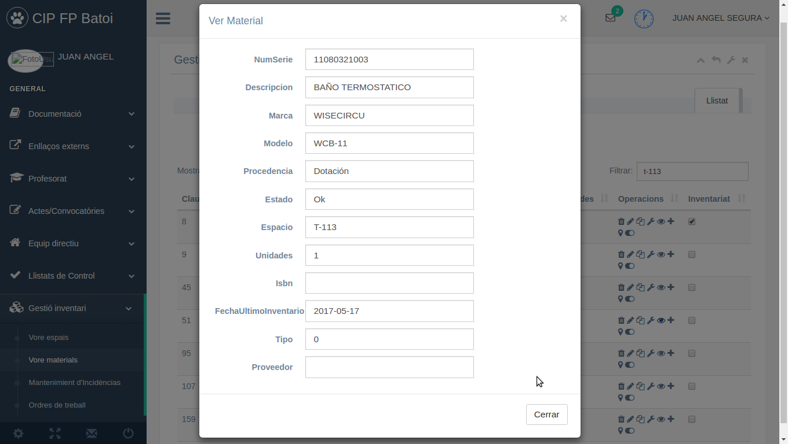

# Realitzar l'inventari
Per a que l'inventari mostre realment tots els materials existents al centre cal fer-ho en poc temps i no moure elements d'un espai a altre mestres que es fa per tal de no comptar eixos elements dues vegades o cap.

Només pot fer l'inventari les persones que tenen el rol de '_Manteniment_'. Si el tenim en la intranet ens apareixerà un nou grup d¡opcions en el menú anomenat '**Gestió inventari**' des d'on podem:
* Veure espais: ací tenim tots els espais del centre i quan polsem sobre el botó de '_Detalls_' d'un d'ells es mostren tots els elements que conté
* [Veure materials](#veure-materials): ací trobem tots els materials del centre i es des d'on farem el inventari.
* Manteniment d'incidències: ací els apareixen les incidències obertes pels professors a la gent que te que solventar-les 
* Ordres de treball: ací apareixen les ordres de treball obertes per a personal de fora del centre

Nosaltres no hem d'entrar mai a les 2 darreres opcions del menú. Farem l'inventari des de l'opció de '_Veure materials_'.

## Veure materials
El primer que farem és filtrar la taula per a no veure tots els materials del Centre sinò només els de l'espai que anem a inventariar. Per a això tenim sobre la taula a la dreta el quadre 'Filtrar' (zona 1 de la figura, color roig) on escriurem el nom curt de l'espai

Si hi ha més materials dels que es mostren en la taula (zona 2 groc, baix) podem indicar que es mostren 50 o 100 registres per pàgina (zona 2 groc, dalt).

Podem ordenar la taula per qualsevol columna (Codi, Descripció, Estat, ...) polsant sobre eixa columna.

Ara ja podem inventariar l'espai. Comprovem que cada material correspon al que posa en la taula. En la columna _Estat_ apareix un codi que indica:
* 1 = Ok
* 2 = Reparant-se
* 3 = Baixa

En la columna _Operacions_ (zona 4, verd) tenim iconas per a cada cosa que podem fer amb un material 

:

1. **Esborrar** (icona de la paperera): elimina totalment el material. NO HO HEM DE FER MAI perquè la majoria de materials estan comptabilitzats i abans d'esborar-los s'han de donar de baixa des de Secretaria.
2. **Editar** (llapicera): ens permet canviar la descripció del material i altres dades
3. **Copiar** (dues fulles): crea un nou material copiant totes les dades d'aquest material
4. **Crear incidència** (clau anglesa): s'obri la finestra de crear una nova incidència sobre aquest material per si hi ha un problema amb ell
5. **Veure** (ull): ens permet veure totes les dades d'aquest material, no nomes el resum que mostra la taula
6. **Canviar unitats** (+): per a afegir o llevar unitats en els elements que consten de vàries
7. **Canviar ubicació** (marcador de mapa): per a indicar que aquest material ara es troba en altre espai (si no l'inventariem nosaltres li ho hauríem de comunicar a la persona que inventaria eixe espai per a que no afegisca un nou material)
8. **Canviar estat** (interruptor): per a canviar l'estat del material.

## Fer l'inventari
El que hem de fer per a cada material és:
* Veure el material i comprovar totes les seues dades

* Si hi ha alguna cosa mal canviar-la:
    * si és el número d'unitats des del botó de '_Canviar unitats_'
    * si és la seua ubicació des del botó de '_Canviar ubicació_'
    * si és el seu estat (perquè el volem donar de baixa o perquè està reparant-se) des del botó de '_Canviar estat_'
    * si es altra data (descripció, marca, ...) des del botó de '_Editar material_'
* Si hi ha un problema amb el material crearem una nova incidència indicant-lo
* Quan tot és correcte només hem de marcar la casella de '_Inventariat_' (zona 5, blau)

Si hi ha un nou material que no apareix en el llistat en primer lloc ens haurien d'assegurar que no estaba abans en altre espai:
* Si estaba inventariat an altre espai busquem en la taula eixe material (filtrant per la descipció o per l'espai on estaba) i li canviem la ubicació per a que aparega en el nostre espai (caldria dir-li a qui inventaria eixe espai que ho hem canviat al nostre)
* Si es un nou material podem crear-lo copiant-lo d'altre semblant (així tindrem la majoria de dades ja introduïdes) o be creant-lo nou des de botó de '**Crear material**' que hi ha damunt de la taula

Una vegada comprovat marcarem la seua casella de '_Inventariat_'.

Si en l'espai no es troba un material que apareix en la taula pot pasar:
* Que ara està en altre espai: en eixe cas canviarem la seua ubicació a l'espai on ara es troba (i li ho direm a qui fa l'inventari d'eixe espai)
* Que el material es va trencar i es va tirar: canviarem el seu estat a '_Baixa_' i **¿¿¿OBRIM UNA INCIDÈNCIA???**
* Que el material ha desaparegut: **¿¿¿QUÈ FEM???**

