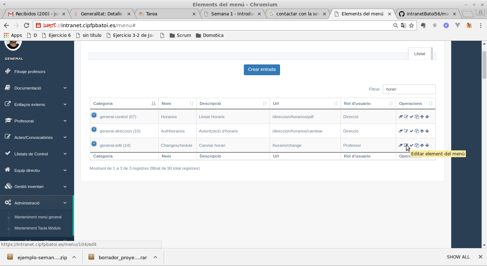
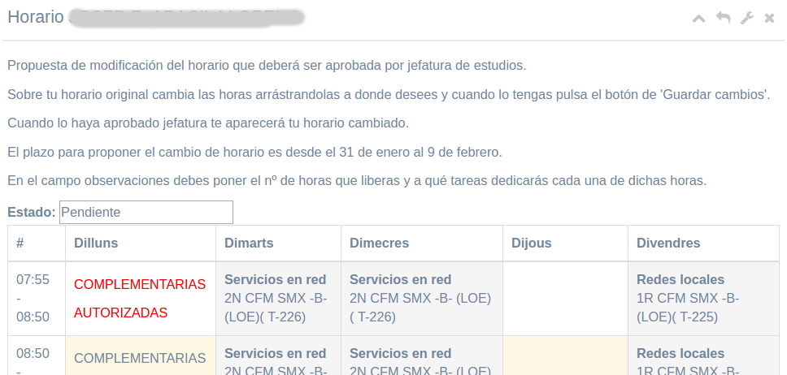
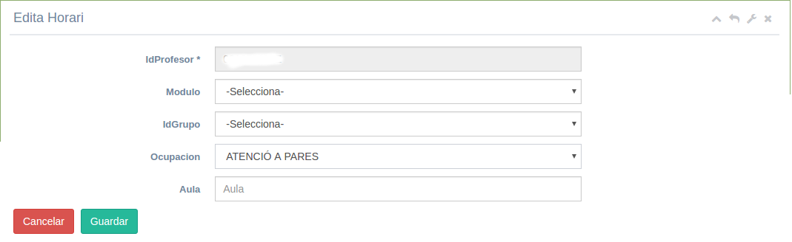
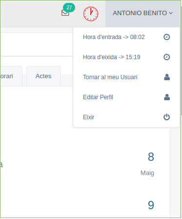

# Manual de Cap d'Estudis i Direcció
Índex de continguts
* [Introducció](#introducció)
* [Tasques habituals](#tasques-habituals)
  * [Canvis dels horaris](#canvis-dhorari)
* [Menú 'Equip directiu'](#menú-equip-directiu)
  * [Cursos /Ponències](#)
  * [Dades professors](#dades-professors)
---

## Introducció
Aquest manual només explica les accions que pot fer el cap d'estudis o director i no un professor normal. Les accions habituals de qualsevol professor estan explicades en el manual del professor.

L'accés a la intranet és igual per a tots els professors i és el sistema qui detecta quin és el seu rol (professor, tutor, cap de departament, …) i mostra les opcions adequades en cada cas.

Els membres de l'equip directiu tenen en el menú general un apartat anomenat 'Equip directiu' i també noves opcions en alguns altres menús.

Aquest manual explica al principi com fer determinades tasques i després explica com funciona cada opció dels menús.

## Tasques habituals

### Canvis d'horari
Quan els professors alliberen hores perquè els alumnes de 2n curs sen van a fer la FCT poden fer canvis en els seus horaris. 

#### Activar els canvis per als professors
Pera a que puguen fer els canvis en el seu horari s'ha d'activar aquesta opció del menú (per defecte està desactivada perquè només es poden fer canvis quan s'alliberen les hores de 2n). Es fa des del _Menú **Administració** -> Manteniment del menú general_. Busquem l'opció de 'Canvi horari? (podem filtrar la taula) i l'editem:

Editem el registre i canviem el camp _**Estat**_ (l'últim) per a habilitar aquesta opció en el menú:
* 0: no habilitada
* 1: habilitada

Quan està habilitada a tots els professors els apareix en el menú '_Professorat_' l'opció de '_Canviar horari_'.

#### Aprovar horaris
Una vegada els professors han fet els canvis en els seus horaris s'han d'aprovar des de direcció. Es fa des de la taula de professors: _menú **Equip directiu** -> Dades Professors_. En la taula amb tots els professors tenim les següents opcions referents als horaris:

* Horari (1a icona): permet veure l'horari actuañ del professor
* Canviar horar (antepenúltima icona): obri la pantalla de modificació d'horari. Aquesta icona és diferent si el professor ha fet ja una proposta de canvi (segona filera de l'exemple, icona de taula amb 9 quadres) o si no ha fet cap proposta (primera filera, icona de taula amb 4 quadres grans).

La pantalla de modificar l'horari és la mateixa que teel professor per a canviar el seu horari:

El primer que apareix en la pantalla es l'_Estat_ del canvi que pot ser:
* No hi ha proposta: el profesor no ha proposat cap canvi d'horari
* Pendent: el professor ha fet la proposta de canvi que es mostra
* Aprovat: direcció ja ha aprovat el canvi. El professor ja no pot fer modificacions
* Guardat: el canvi ja s'ha aplicat a l'horari del professor

En l'horari les hores canviades apareixen en roig. A banda dels canvis fets pel professor l'equip directiu pot fer més canvis (arrastrant i soltant les hores, igual que fan els professors).

Quan tot siga correcte s'ha de **aprovar** la proposta pulsant el botó que hi ha baix de la taula de l'horari. L'estat de la proposta canvia a '_Aprovat_' i el professor ja no pot fer més modificacions, però sí l'equip directiu (després ha de tornar a aprovar l'horari). 

#### Canviar un horari
Quan un horari està aprovat apareix un nou botó de **Aplicar els canvis**. Això el que fa es que els canvis s'apliquen a l'horari del profesor que pasa a ser el nou horari. A més l'estat canvia a '_Guardat_'. Aixó només es fa en cas de una modificació puntual. 

#### Canviar tots els horaris
Quan direcció ha aprovat tots els canvis d'horari per aplicar-los tots (sense haver d'anar un per un) es fa des del _menú **Equip directiu** -> Autorització d'horaris_. Ací tenim un botó que farà els canvis de tots els horaris i en aquesta pantalla apareixerà qualsevol error que puga sorgir. 

#### Canviar funcions d'horari
A més de moure una hora a altra diferent  l'equip directiu també podem canviar el contingut d'una hora (per exemple per a posar una nova guàrdia on hi havia altra cosa). Això es fa també des de la taula de professors (_menú **Equip directiu** -> Dades Professors_) amb la penúltima icona (el raig).

Ens mostra una taula amb cada entrada de l'horari amb el mòdul, el grup (o l'ocupació) i quan s'imparteix i un botó d'editar:

Des d'ací podem canviar a què dedica el professor eixa hora.

## Menú 'Equip directiu'
Ací tenim la majoria d'accions:

### Cursos / Ponències

### Dades professors
Ací tenim una taula amb tots els professors actius del Centre que podem filtrar, ordenar, ... 

Les acciones que podem fer són:
* **Horari**: mostra l'horari del professor
* **Editar**: ens mostra el perfil del professors des d'on podem canviar:
  * e-mail del centre
  * fotografia
  * departament al que pertany (ho hem de fer en tots els nous professors perquè en Itaca no apareix el departament)
  * idioma de la intranet
  * si es mostra o no el seu telèfon en la intranet als companys de departament
  * rol: només direcció i els administradors poden canviar el rol d'un usuari. Tot el mon ha de tindre al menys el rol '_Tots_' i el rol de '_Professor_' o '_Alumne_'.
* **Carnet**: permet imprimir el carnet d'eixe professor
* **Més dades**: podem veure totes de dades del professor, però no canviar-les (s'ha de canviar a Itaca)
* **Canviar horari professor**: per a autoritzar el canvi d'horari com s'explica en el [manual de canviar horari](#canvis-dhorari)
* **Canviar funcions d'horari**: per a modificar què fa un professor una hora determinada com s'explica en el [manual de canviar horari](#canvis-dhorari)
* **Canviar usuari**: ens permet funcionar com si forem l'usuari indicat. Per a tornar al nostre usuari es fa des del menú del perfil amb l'opció de _Tornar al meu usuari_.

