    
## AJUDA DE LA PART D'FCT DE L'ALUMNAT

            
    Per a entrar en la part d’FCTs des de la intranet hem de fer clic damunt de FCTs dins de la part Pràctiques com es pot veure a la (Captura 1).

 

   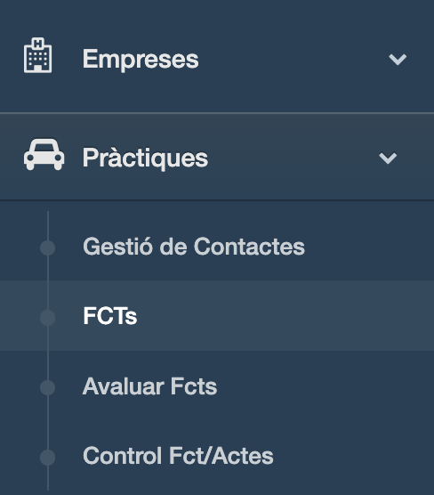
   
   **Captura 1**

    

   I quan estiguem dins veurem el següent:

   

   **Captura 2**

    

   Anem a descriure cada opció que veiem en aquaquesta pantalla.

   En la part superior dreta veiem una sèrie d'icones.

  

   

   **Captura 3**

    

   D'esquerra a detra tenim:

    Amb aquesta icona pleguem o despleguem la pantalla.

    Amb aquesta icona tornem a la pantalla principal de la intranet.

    Amb aquesta icona podem seleccionar l’idioma que volem que tinga tot el que veiem a la pantalla.

   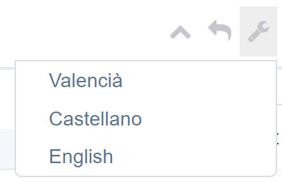

    Amb aquesta icona accedim a aquesta ajuda.

    Amb aquesta icona es tanca tot el contingut de la pantalla. Si fem això hem de tornar a accedir a la part d’FCT igual que ho hem fet des de la (Captura 1).

   A la (Captura 2) veiem una sèrie de botons amb fons blau. D'esquerra a dreta tenim:

   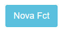 Este botó és per a la creació d’una FCT a la intranet. La pantalla que vorem és la següent (Captura 4).

   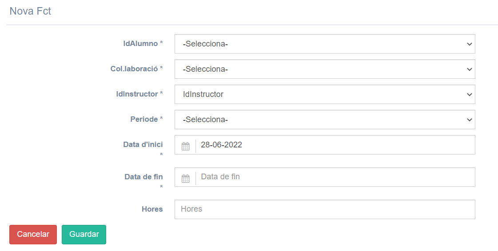 
   
   **Captura 4**

    

   A la primera llista desplegable (IdAlumno) apareixerà tot l'alumnat que pot fer les pràctiques i s'haurà d'elegir l'alumne o alumna que volem crear-li l'FCT.

   A la llista desplegable (Col·laboració) apareixeran les empreses on l'alumne o alumna farà l'FCT i caldrà triar una.

   A la llista desplegable (IdInstructor) caldrà seleccionar l'instructor de l'empresa. Pot ser que una empresa tinga més d'un instructor i és ací on s'haurà de seleccionar.

   A la llista desplegable (Periode) s'haurà de dir quin període és el de la realització de les FCT. 

    

   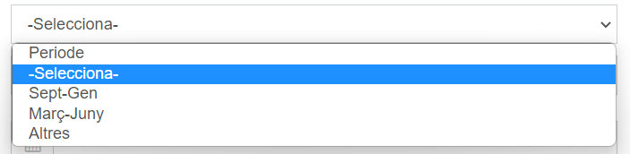

   **Captura 5**

    

   El camp (Data d'inici) té una icona amb forma de calendari i és on s'ha de dir la data de començament de les pràctiques. A aquest camp tenim dues opcions per introduir les dates. O bé s'escriu a mà o bé es polsa damunt de la icona de calendari , es desplega el mes y any actuals i es selecciona la data que volem. Veure la (Captura 6).

   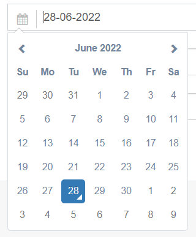

   **Captura 6**

    

   El camp (Data de fin) té la mateixa funcionalitat que el camp (Data d'inici) i serveix per a indicar la data de finalització de l'FCT.

   Finalment, el camp (Hores) s'usa per a escriure el nombre d'hores de durada de l'FCT. Els botons roig i verd de la part inferior esquerra són per guardar la informació introduïda (Guardar) o (Cancelar) si el que volem és esborrar tot el que s'ha introduït.

   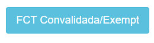 Aquest és el segon botó blau d'esquerra a dreta de la (Captura 2).

   Aquest botó serveix per a indicar al sistema si tenim algun alumne o alumna que està exempte de realitzar les FCT. La pantalla que veem quan polsem eixe botó és:
    

   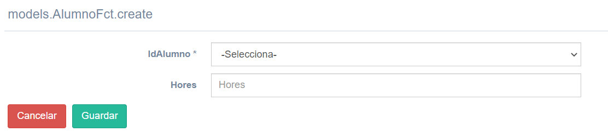

   **Captura 7**

    

   A la llista desplegable (IdAlumno) seleccionem l'alumne o alumna que està exempte/a de fer les FCT (totalment o parcialment).

   Els botons roig i verd de la part inferior esquerra són (Cancelar) si el que volem és esborrar tot el que hem introduït al formulari i tornar a la pantalla anterior, i per guardar la informació introduïda polsarem en (Guardar).

   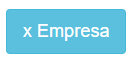  Aquest és el tercer botó blau d'esquerra a dreta de la (Captura 2).

   Quan polsem al botó (x Empresa), la nova pantalla ens mostra el llistat d'FCTs actives ordenades alfabèticament per nom d'empresa (Captura 8).

   Com es pot veure a la captura, els encapçalaments de les columnes han canviat respecte al llistat ordenat alfabèticament per alumnes. Cal dir que si fem clic damunt dels títols de les columnes (Centro, Periode, Contacto i Operacions), les dades canvien de major a menor o viceversa (alfabèticament, numèricament, etc.)

   El botó de la Captura anomenat (x Alumne/a) torna a la pantalla de la (Captura 2) i ens mostra la llista d'FCTs actives ordenades alfabèticament per alumne/a.

   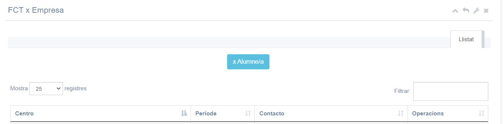

   **Captura 8**

    

   Continuant en la descripció de cada opció de la (Captura 2), tenim:

   **Imprimeix Full Control Servei:** aquesta opció serveix per a generar un arxiu pdf que s'haurà de lliurar al departament d'FCTs una vegada tenim tots els documents que se'ns demana abans de començar les pràctiques.

   La pantalla que apareix quan polsem a aquesta opció té el següent aspecte:

   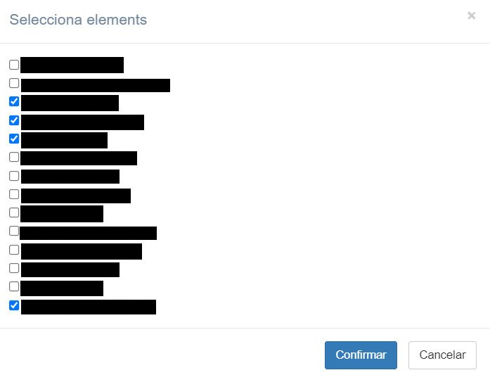

   **Captura 9**

    

   Hem de seleccionar als alumnes que volem que apareguen al pdf que es generarà quan polsem el botó (Confirmar) de la part de baix dreta.

   La raó de ser d’aquesta part s’explica al «Dossier Tutor_a de FCT» que t’hauran facilitat si eres tutor/a d’FCTs. Evidentment, polsant el botó (Cancelar) tornem a la pantalla de la (Captura 2).

   El pdf generat té el següent aspecte:

   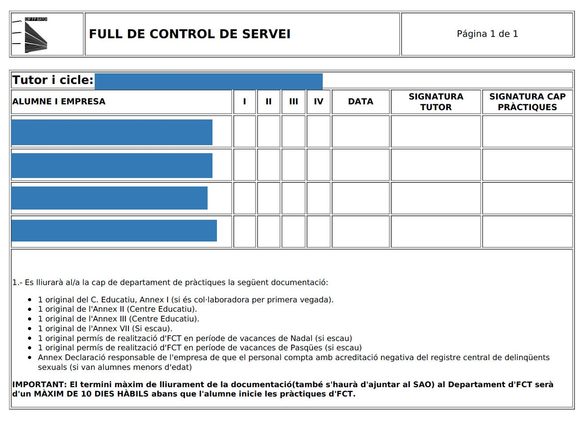

   **Captura 10**

    

   **Imprimeix Entrevista Final Instructor/a:** aquesta opció serveix per a generar un arxiu pdf que s'haurà de generar una vegada l'alumne/a o alumnes hagen acabat el període de pràctiques.

   La pantalla que apareix quan polsem a aquesta opció té el mateix aspecte que la (Captura 9) però en aquesta ocasió en lloc d'elegir alumnes, elegim instructors/es de les empreses.

   Quan polsem en el botó (Confirmar) es genera un pdf com el següent:

   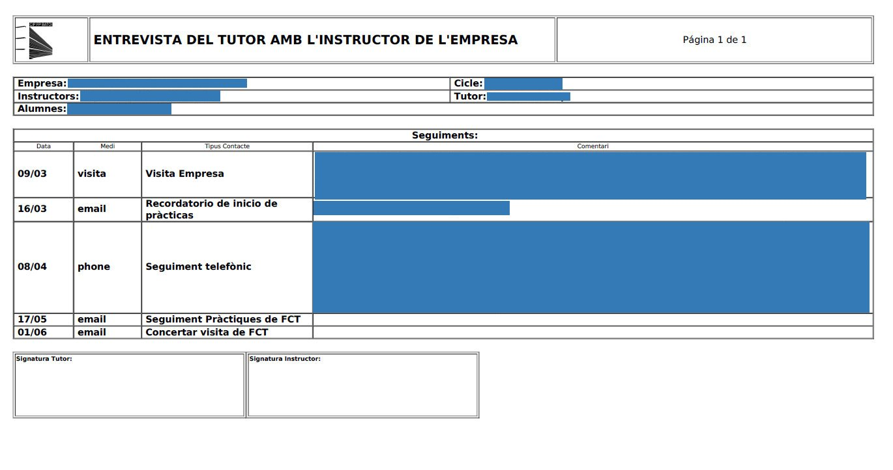

   **Captura 11**

    

   La informació continguda en aquest document fa referència a tots els contactes, tant telefònics com presencials, que s'han fet amb l'empresa on està fent les FCT l'alumne/a.

   Com es pot veure al peu de la captura, tant el tutor/a d'FCTs com l'instructor/a de l'alumne/a han de signar en els rectangles corresponents.

   **Imprimeix Entrevista Alumnat:** aquesta opció serveix per a generar un pdf que hauran de signar els alumnes que estan fent les FCT. Una vegada al mes, el tutor/a convocarà a l'alumnat al centre per saber com van desenvolupant-se les pràctiques i perquè intercanvien experiències entre ells/es.

   Quan polsem damunt d'aquesta opció, ens apareix una pantalla com la de la (Captura 9) perquè seleccionem l'alumnat que volem convocar i una vegada polsem en el botó (Confirmar) es generarà un pdf com el següent:

   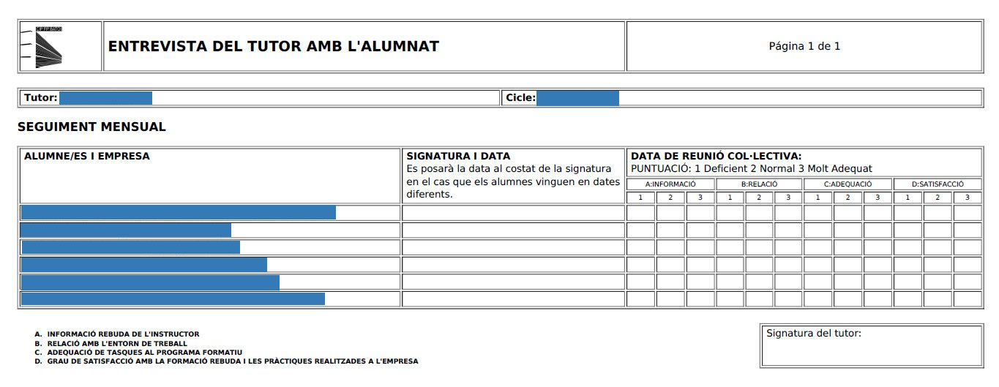

   **Captura 12**

    

   Com es pot veure en la captura, cada alumne/a ha de signar en la columna SIGNATURA I DATA i puntuar entre 1 i 3 cada un dels ítems A, B, C i D.

   Finalment, el tutor d'FCT signa també el full.

   **Imprimeix Full de Vacances:** aquesta és l'última opció de les que apareixen a la pantalla de la (Captura 2). Igual que s'ha operat amb l'anterior opció, quan polsem damunt apareix una pantalla igual que la (Captura 9) a on es seleccionarà l'alumnat del qual es vol generar el pdf i polsarem damunt del botó (Confirmar). El pdf generat té el següent aspecte:

   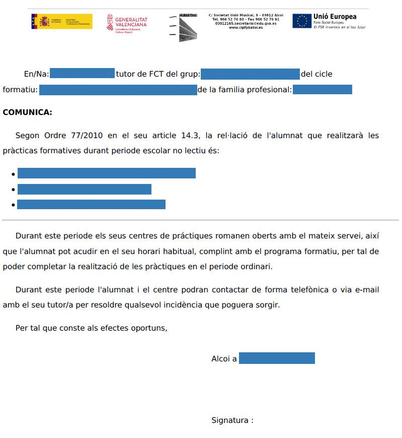

   **Captura 13**

    

   Com es pot llegir al document generat, es tracta d'una comunicació al departament d'FCT de l'alumnat que treballarà durant el període de vacances de Nadal i Setmana Santa si l'empresa on l'alumnat està fent les pràctiques no tanca en aquest període.

   Caldrà repetir aquesta acció tant a les vacances de Nadal com les vacances de Setmana Santa i lliurar el document signat pel tutor o tutora de l'alumnat relacionat al document de la (Captura 13).

   Ara es continua amb les opcions que queden per comentar de la (Captura 2).

   Per una banda, tenim la següent llista desplegable:

   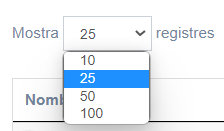

   **Captura 14**

    

   Ací se selecciona el nombre de registres que volem veure a la pantalla de la (Captura 2), que poden ser 10, 25, 50 o 100 registres en una mateixa pantalla. Per defecte està seleccionat el valor 25.

   Per l’altra banda, tenim el següent quadre de text anomenat “Filtrar”.

   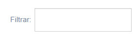

   **Captura 15**

    

   En aquest quadre de text es pot introduir el text que volem cercar d'entre tots els registres. Aquesta opció és molt útil quan es tenen molts registres i es volem filtrar per trobar-ne un en concret. 

   Per acabar la part d'FCTs de la part "Pràctiques" de la intranet del centre comentar que les columnes de dades que hi ha a la (Captura 2) són les següents:

    

   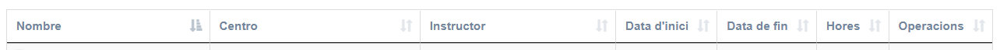

   **Captura 16**

    

   **Nombre:** Nom de l’alumne/a.

   **Centro:** Empresa a on està l’alumne/a fent les pràctiques.
   
   **Instructor:** Nom de l’instructor/a de l’alumne/a.

   **Data d’inici:** Data de començament de les pràctiques de l’alumne/a.
   
   **Data de fin:** Data de finalització de les pràctiques de l’alumne/a.
   
   **Hores:** Hores que l’alumne ha de fer com a mínim. 380 hores per a les FCT de cicles de grau mitjà i 400 hores per a les FCT de cicles de grau superior.
   
   **Operacions:** Ací tenim una serie d’icones que tenen el següent aspecte:

    

   

   **Captura 17**

    

   D'esquerra a dreta, la primera icona és per esborrar un registre.
   
   La segona icona és per modificar les dates d'inici i finalització i també el nombre d'hores del període de pràctiques.
   
   La tercera icona és per veure informació sobre el registre seleccionat.
   
   L'última icona és per a descarregar el certificat de l'alumne/a on es diu si l'alumne/a és Apte/a o no.

    

   **FI DE L'AJUDA**

   

