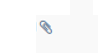

Esta página es centra en el proces d'avaluació dels alumnes matriculats en el mòdul projecte i el de FCT.

Per a cada alumne matriculat en qualsevol d'eixos mòduls tenim una serie d'operacions disponibles que son les següents:

* [ MANETA AMUNT i MANETA AVALL] Marcar si en la FCT es apte o no.

* [ CLIP ] Pujar els anexes A5 i A6 a la intranet. 

| Icona | Descripció |
| --------- | --------- |
| MANETA AMUNT I MANETA AVALL | Marcar si l'alumne es qualificat APTE ò NO APTE en la FCT |
|  | Marcar si existeix inserció laboral | 
|  | Pujar els anexes A5 i A6 de l'alumne. Aquestos anexes s'han de nombrar de la següent forma: *A5 Nom_Cognoms.pdf* i *A6 Nom_Cognoms.pdf*  | 

