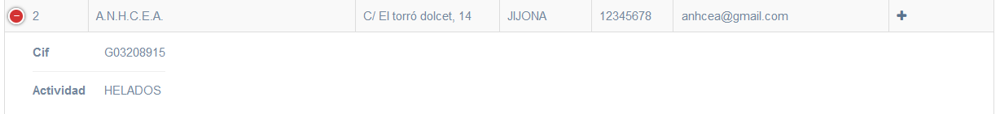

Esta página mostra totes les empreses amb les que s'ha col.laborat o amb les que s'ha contactat al llarg del temps a nivell de centre.

Les empreses que, a més, han col.laborat amb un cert departament, apareixen també a **Col.laboracions Departament**.
___

A nivell de llistat, per cada empresa tenim dues icones que podem fer servir per tal de consultar les seues dades. Si premem sobre la icona  **+** de l'esquerra, ens mostra el seu **CIF** i la seua **activitat**:

Si premem la icona **+** de la dreta ens mostra totes les dades de l'empresa i ens permet editar-les:

___

A la página de [Preguntes frequents](faqs.md) pots consultar:
  * Com anyadir una empresa que no ha colaborat abans amb el centre.
  * Com crear una col.laboració amb el departament.
  * Com crear un nou instructor o un nou centre de treball.

