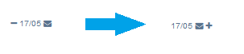

Esta página mostra totes les empreses que han col.laborat amb el nostre cicle formatiu. 

Tenim 3 pestanyes en la part superior:

* **Pendents**. Ací estan les col·laboracions del cicle que encara no hem catalogat.
* **Colabora**. Les col·laboracions que acolliran o estan acollint algun alumne enguany.
* **Descartada**. Les empreses que ens han dit que no volen col·laborar.

Per a passar una col·laboració d'una pestanya a una altra, primer ens les hem d'assignar (Si sóm l'unic tutor del cicle, ens les hauriem d'assignar totes, si no, ens les hauriem de dividir amb els altres tutors per tal de no contactar tots).
___
**Truc** Si no volem col·laborar amb una empresa podem no assignar-nos-la.**
___

Una vegada assignades, perden el botó groc d'assignar i passen a tindre els botons verd i roig de **SI** i **NO**, que podem pitjar per classificar-les.
 
Cada pestanya presenta, a la part de dalt, una serie de botons amb accions. Ixem més o meyns botons dependent de en quina part del procés estem. Eixos botons són col·lectius, s'apliquen a totes les col·laboracions que complixen amb els requeriments del botó en qüestió. 

___
**Per què uns botons són blau oscur i altres blau clar?** El blau oscur indica un contacte mitjançant un correu que puc modificar abans d'enviar-lo. El blau clar, en canvi, enviarà els correus de forma automàtica a totes les col·laboracions que complisquen el requeriment.**
___

## Pestanya **Pendents**

Esta pestanya la fem servir en la fase de recerca de col.laboracions. El botó **Sol·licitud de pràctiques** envia un correu sol.licitant la col.laboració a les empreses. Al premer el botó ens apareix el llistat de colaboracions i podem seleccionar les colaboracions que desitgem:

Una vegada feta la selecció podrem editar el cos del correu que per defecte es el següent:

~~~ 
 El meu nom és Ignasi Gomis Mullor i sóc el professor-tutor del Cicle Formatiu de Grau Superior Desenrotllament d'aplicacions web del Centre Integrat Formació Professional Batoi.
Les classes de segon curs acaben a principis de març, i després, els alumnes han de fer 400 hores de pràctiques en empreses, organitzacions, entitats ..., en l'horari normal de l'empresa (que sol ser 40 hores setmanals). Com tots els anys, estem buscant llocs de pràctiques per als nostres alumnes i hem pensat que potser la vostra empresa podria acollir les pràctiques d'un dels alumnes. Actualment, tenim alumnes que estarien molt interessats en fer les seues pràctiques en una empresa com la vostra. L'unic requeriment es dispossar d'almenys un tècnic, que puga tutoritzar les pràctiques en l'empressa. Per tot això, ens agradaria que consideràreu la possibilitat d'acollir les pràctiques d'un dels nostres alumnes entre el 11 de març i el 10 de juny, aproximadament.
Òbviament, abans de prendre la vostra decisió, parlaríem tot allò que fera falta i també podríeu entrevistar als alumnes candidats. En qualsevol cas, moltes gràcies per considerar la nostra sol·licitud.
Salutacions cordials de Ignasi Gomis
~~~ 

___
## Pestanya **Colabora**

En esta pestanya els botons están ordenats en funció de cada fase en el proces de gestió de les FCT i els farem servir en aquest ordre:
1. Abans de començar les FCT: **Revissió de documentació**
2. Al inici de les FCT: **Recordatori d'inici** i **Documentació Alumnat**
3. Una vegada que els alumnes están cursant el mòdul d'FCT farem servir els botons **Seguiment**, **Concertar visita** i **Citar alumnat** quan siga necessari.

Una vegada que ja tenim empreses dispostes a col.laborar, es hora de comprovar que les seues dades son correctes. Per tal de dur a terme esta tasca fem servir el botó **Revissió de documentació** que envia un correu automàtic a tots els contactes de les col·laboracions de la pestanya de colabora amb el següent text:

~~~ 
Hola Carlos Fabra,
Estic preparant la documentació corresponent a les pràctiques de FCT del Cicle Formatiu de Grau Superior 'Desenrotllament d'aplicacions web' , i necessitaria que em confirmàreu els següents detalls de la documentació oficial:
Empresa: Ninots Fallers,SA 
CIF: 11115551Z
Telèfon: 567812520
Adreça: Avinguda Pais Valencià, 13 2-C
Poble: Ontinyent
Email-Empresa :
Horari Pràctiques:
Tria Instructor:
Nom: Carlos Fabra 
E-mail: carlos@ninot.com
DNI : 29205051A
Telèfon: 567812520
O afegueix un altre:
Nom: ___________________________________________
E-mail : ____________________________________
DNI : _____________________________________
Telèfon: __________________________________
Salutacions cordials de Ignasi Gomis
~~~ 
  
Al inici de les FCT, quan els alumnes estan a punt de començar, farem servir el botó **Recordatori d'inici** que envia un correu automàtic als contactes de les col·laboracions amb el següent text:

~~~ 
Hola Joan Ferre Ferre,
T'escric per recordar-te l'inici de les pràctiques de FCT. A continuació et passe relació dels alumnes que t'han estat assignat i les dades de començament de les pràctiques.
Instructor: Emilio Silvestre Sánchez

Data de començament: 14-07-2019

Alumnes assignats:

Mireia Bolla Sánchez - iperez@cipfpbatoi.es
Aprofite per donar-te les meues dades per si necessiteu possar-se amb contacte amb mi:
Tutor: Ignacio Pérez iperez@cipfpbatoi.es 
Telèfon centre: 966 52 76 60 
Així com també informació relevant en cas d'accident laboral que trobaràs en aquest enllaç http://www.ceice.gva.es/va/web/formacion-profesional/seguro
Per qualsevol dubte em tens a la teua disposició
Salutacions cordials de Ignasi Gomis
~~~ 

L'us d'aquest botó d'inici es queda enregistrat en cada una de les fitxes de les empreses amb l'aparició de la següent icona:

En aquest moment de les FCT hem de fer servir el botó **Documentació alumnat** que envía un correu a l'alumne/a en el que se li informa de la data d'inici de les FCT i de la asegurança. **L'enviament d'aquest correu no es veu reflectit a les fitxes de les empreses però sens envia també al nostre correu personal, així queda constància de que s'ha enviat**. La següent imatge mostra el contingut d'aquest correu:

Una volta iniciada la FCT farem servir el botó **Seguiment** per tal d'enviar correus automàtics als instructors per tal de demanar-los informació. S'envía el següent text:

~~~ 
Hola Emilio Sánchez,
T'escric per conèixer de primera ma com van les pràctiques FCT dels alumnes:
Mireia Bolla Sánchez
Si tot està correcte et tornaria a contactar en aproximadament 15 dies per a fer una visita al centre de treball.
Aprofite per recordar-te les meues dades per si necessites possar-te amb contacte amb mi:
Tutor: Ignacio Pérez igomis@cipfpbatoi.es 
Telèfon centre: 966 52 76 60 
Per qualsevol dubte em tens a la teua disposició
Salutacions cordials de Ignasi Gomis
~~~

L'enviament de cada correu queda registrat en la corresponent Fitxa del contacte amb un sobre. Inicialment aquesta icona apareix amb un **-** que indica que no hem aportat retroalimentació de la comunicació. Per tal d'aportar la retroalimentació, premem sobre el text amb la data i s'ens obri un formulari. Una vegada aportada la retroalimentació, la icona pasa a ser un **+** tal com es mostra en la següent imatge. 

Si necessitem editar o consultar la retroalimentació aportada podem premer de nou sobre la data.

Per tal de concertar una visita amb l'instructor fem servir el botó **Concertar visita** que envia el següent correu als instructors. Aquest correu es pot modificar:

~~~
El meu nom és Ignacio Pérez i sóc professor-tutor del Centre Integrat Formació Professional Batoi.
T'escric per tal de concertar una visita al centre de treball, per tal de fer el seguiment de les practiques FCT dels alumnes dels quals eres l'instructor.
Els horaris que em vendrien bé són:
Ja em dius quan et vindria bé.
Salutacions cordials de Ignacio Pérez
~~~

**IMPORTANT:**
L'enviament del correu **Concertar visita** no genera cap nova icona a la fitxa del contacte. En cas d'acordar una data per tal de fer la visita serà necessari tramitar una **comissió de servei** i es aquest tràmit el que genera la corresponent icona. El comportament d'aquesta icona es anàloga a la del sobre. Ens permet aportar una retroalimentació de la reunió:

Durant el període d'FCT hem de citar als alumnes per a que acudisquen al centre, aço ho fem amb el botó **Citar alumnes** que envia un correu als alumnes amb el següent text:

~~~
Et convoque el dia ___________________________ a les _______________ a l'Institut, per a fer el seguiment de les pràctiques de FCT. Recorda't d'emplenar i dur els annexos 4 signats per l'instructor. Si no pots assistir, comunica-me-ho per a tenir-ho en compte i concertar una cita un altre dia.
Salutacions cordials de Ignacio Pérez
~~~

Per finalitzar, una vegada iniciada la FCT, en cada Fitxa de contacte trobem la icona del teléfon que ens permet registrar una conversació telefónica amb l'instructor:

Aquesta icona permet registrar una cridada de telèfon. El comportament es exactament el mateix que el de les icones del sobre i el vehícle, possibilitant el registre de informació de retroalimentació.

