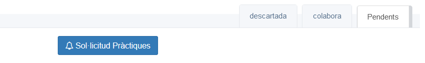

Esta página mostra totes les empreses que han col.laborat amb el nostre cicle formatiu. 

Tenim 3 pestanyes en la part superior:

+ **No assignades**. Ací estan les col·laboracions del cicle que encara no hem catalogat. Al principi estan totes.
* **Pendents de Contestar**. Ens les hem assignades però encara no sabem si col·laboraran.
* **Col·laboren**. Les col·laboracions que poden acollir algun alumne enguany.

Per a passar una col·laboració de la primera pestanya a la segon ens l'hem d'assignar (Si sóm l'unic tutor del cicle, ens les hauriem d'assignar aquelles que considerem, si no, ens les hauriem de dividir amb els altres tutors per tal de no contactar tots).
___
**Truc** Si no volem col·laborar amb una empresa podem no assignar-nos-la.**
___

Una vegada assignades, perden el botó groc d'assignar i passen a tindre els botons verd i roig de **SI** i **NO**, que podem pitjar per classificar-les.
 
Cada pestanya presenta, a la part de dalt, una serie de botons amb accions. Ixem més o meyns botons dependent de en quina part del procés estem. Eixos botons són col·lectius, s'apliquen a totes les col·laboracions que complixen amb els requeriments del botó en qüestió. 

## Que signifiquen totes les dades que hi ha en una col·laboració.

Per ordre a l'esquerra apareix: 

* Nom centre treball (ordenats alfabèticament)
  * Número de conveni i si està actualitzat (ditet)
  * Número de llocs de treball
  * Persona de contacte
  * Telèfon de contacte
  * Email de contacte
  * Població del centre de treball
  * Botons per a :
    * Classificar la col·laboració.
    * Afegir comentaris d'este procés de selecció.
  * Icones amb data que ens indiquen els contactes que hem fet i les anotacions.

  
## Pestanya **Pendents de contestar**

Esta pestanya la fem servir en la fase de recerca de col.laboracions. El botó **Sol·licitud de pràctiques** envia un correu sol.licitant la col.laboració a les empreses. Al premer el botó ens apareix el llistat de colaboracions i podem seleccionar les colaboracions que desitgem:
Un cuadrat de color roig significa que l'empresa no vol col·laborar enguany.

Una vegada feta la selecció podrem editar el cos del correu que per defecte es el següent:

~~~ 
 El meu nom és Ignasi Gomis Mullor i sóc el professor-tutor del Cicle Formatiu de Grau Superior Desenrotllament d'aplicacions web del Centre Integrat Formació Professional Batoi.
Les classes de segon curs acaben a principis de març, i després, els alumnes han de fer 400 hores de pràctiques en empreses, organitzacions, entitats ..., en l'horari normal de l'empresa (que sol ser 40 hores setmanals). Com tots els anys, estem buscant llocs de pràctiques per als nostres alumnes i hem pensat que potser la vostra empresa podria acollir les pràctiques d'un dels alumnes. Actualment, tenim alumnes que estarien molt interessats en fer les seues pràctiques en una empresa com la vostra. L'unic requeriment es dispossar d'almenys un tècnic, que puga tutoritzar les pràctiques en l'empressa. Per tot això, ens agradaria que consideràreu la possibilitat d'acollir les pràctiques d'un dels nostres alumnes entre el 11 de març i el 10 de juny, aproximadament.
Òbviament, abans de prendre la vostra decisió, parlaríem tot allò que fera falta i també podríeu entrevistar als alumnes candidats. En qualsevol cas, moltes gràcies per considerar la nostra sol·licitud.
Salutacions cordials de Ignasi Gomis
~~~ 

___
## Pestanya **Col·laboren**

Ja ens han mostrat la seua voluntat de col·laborar, però encara no hem emplenat la documentació.
Tenim el botó de  **Revissió de documentació**: 

Una vegada que ja tenim empreses dispostes a col.laborar, es hora de comprovar que les seues dades son correctes. Per tal de dur a terme esta tasca fem servir el botó **Revissió de documentació** que envia un correu automàtic a tots els contactes de les col·laboracions de la pestanya de colabora amb el següent text:

~~~ 
Hola Carlos Fabra,
Estic preparant la documentació corresponent a les pràctiques de FCT del Cicle Formatiu de Grau Superior 'Desenrotllament d'aplicacions web' , i necessitaria que em confirmàreu els següents detalls de la documentació oficial:
Empresa: Ninots Fallers,SA 
CIF: 11115551Z
Telèfon: 567812520
Adreça: Avinguda Pais Valencià, 13 2-C
Poble: Ontinyent
Email-Empresa :
Horari Pràctiques:
Tria Instructor:
Nom: Carlos Fabra 
E-mail: carlos@ninot.com
DNI : 29205051A
Telèfon: 567812520
O afegueix un altre:
Nom: ___________________________________________
E-mail : ____________________________________
DNI : _____________________________________
Telèfon: __________________________________
Salutacions cordials de Ignasi Gomis
~~~ 
