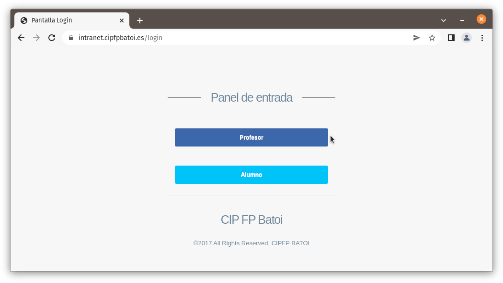
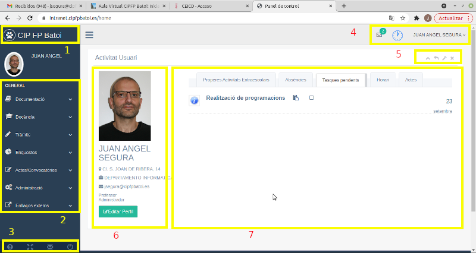
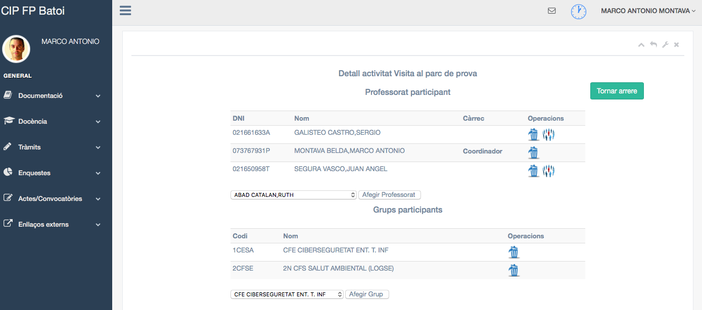
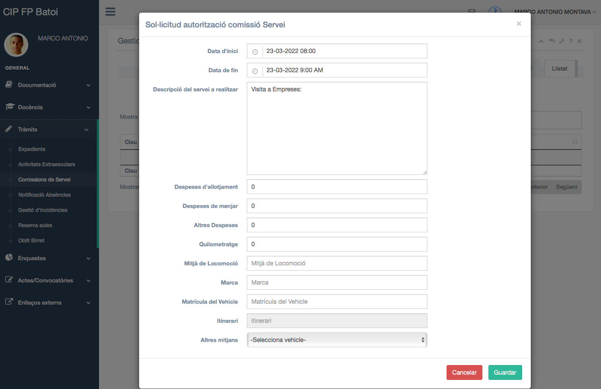
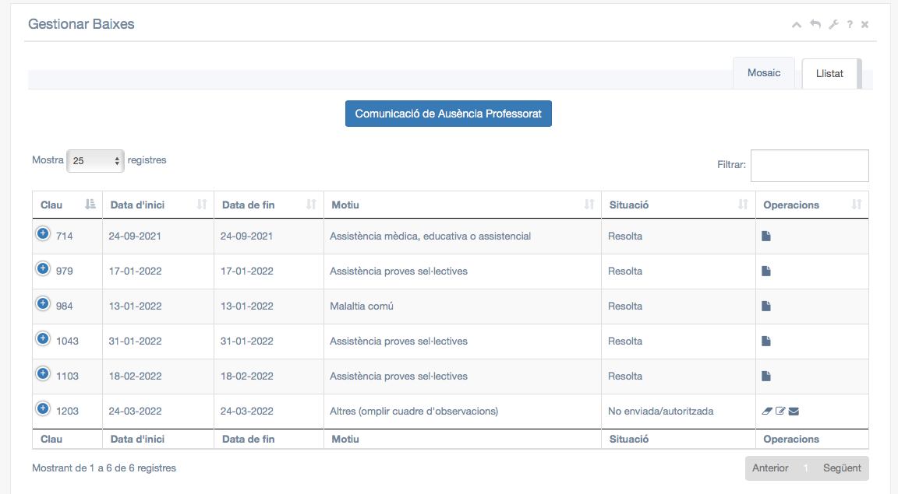
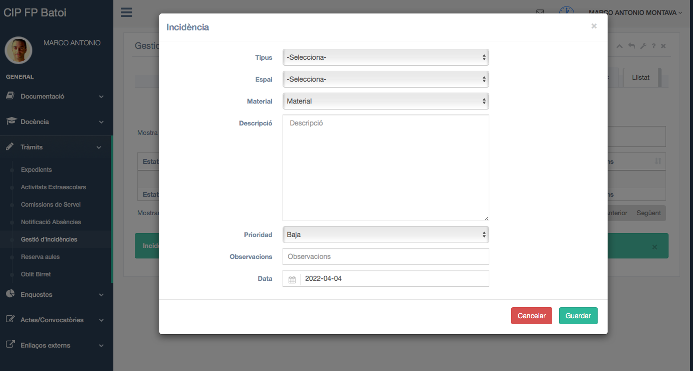
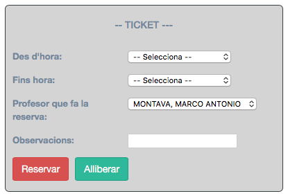
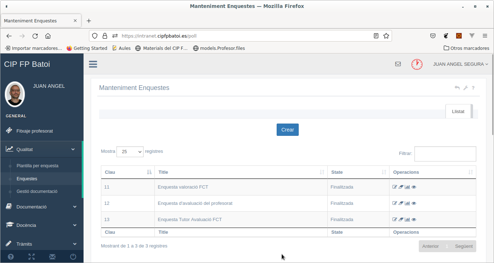
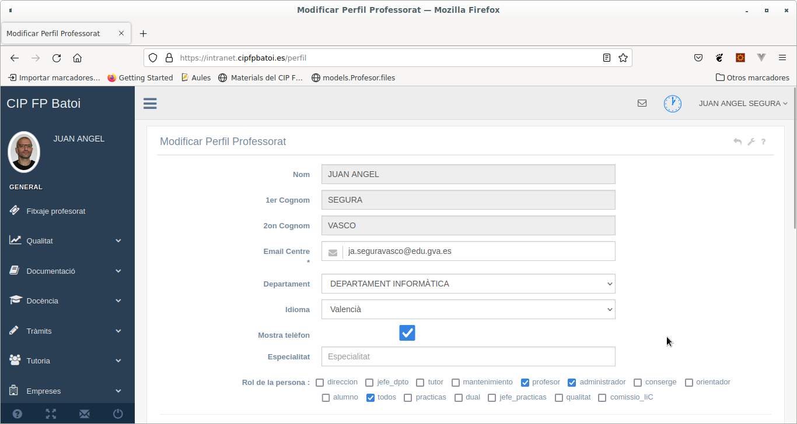

# Manual del professor

Índex de continguts:

* [Entrada](#entrada)
  * [Pàgina d'inici](#pàgina-dinici)
  * [Control de presència](#control-de-presència)
  * [Notificacions](#notificacions)
* [Menú Documentació](#menú-documentació)
  * [Programacions](#veure-les-programacions)
  * [Gestió de Centre](#gestió-de-centre)
  * [Informació de Centre](#informació-de-centre)
  * [Actes](#actes)
  * [Projectes](#projectes)
* [Menú 'Docència'](#menú-docència)
  * [Gestió de grups](#gestió-de-grups)
  * [Claustre](#claustre)
  * [Equip directiu](#equip-directiu)
  * [Guàrdia](#guàrdia)
    * [Fer la guàrdia](#fer-la-guàrdia)
  * [Seguiments](#seguiments)
  * [Programacions](#programacions)
  * [Tancament de curs](#tancament-de-curs)
* [Menú 'Tràmits'](#menú-tràmits)
  * [Expedients](#expedients)
  * [Activitats extraescolars](#activitats-extraescolars)
    * [Alta de nova activitat](#alta-de-nova-activitat)
  * [Comisions de servei](#comisions-de-servei)
    * [Estat de una comissió](#estat-de-una-comissió)
    * [Alta nova comissió](#alta-nova-comissió)
  * [Notificació absències](#notif`i`cació-absències)
  * [Gestió d'incidències](#gestió-dincidències)
  * [Reserva aules](#reserva-aules)
  * [Oblit birret](#oblit-birret)
  * [Canviar horari](#canviar-horari)
* [Menú Enquestes](#menú-enquestes)
* [Menú Actes/Convocatories](#menú-actesconvocatories)
  * [Gestió de reunions](#gestió-de-reunions)
  * [Grups de treball](#grups-de-treball)
* [Menú Enllaços externs](#menú-enllaços-externs)
* [Altres accions](#altres-accions)
  * [Taules amb informació](#taules-amb-informació)
  * [Editar el nostre perfil](#editar-perfil)

## Entrada
L'entrada a l'aplicació es realitza des de qualsevol dispositiu connectat a la xarxa del Centre, tant cablejada com WiFi. Per tant, a més del PC del aula podem usar el nostre portàtil, una tablet o el mòbil. Actualment també es pot accedir des de fora del Centre mitjançant l'enllaç que heu rebut al vostre email del Centre.

El més senzill és polsar el botó roig de 'Google' i serà ell qui ens autentifique demanant-nos el nostre compte d'email del Centre (si ja el tenim obert entrem directament).

També podem polsar el botó blau de 'Professor' (recomanat si estem en un equip que no és el nostre i no volem autenticar-nos amb Google) e introduir l'usuari (el nostre codi de 4 números o el nostre compte d'email del Centre) i la contrasenya (al principi el nostre DNI amb 0 davant, com apareix en Itaca, però és convenient canviar-ho).

Una vegada dins estarem en la pàgina d'inici des d'on tenim accés a totes les opcions.

### Pàgina d'inici
Des de qualsevol pàgina podem accedir a aquesta pàgina polsant sobre el nom del Centre (part superior esquerra de cada pàgina).

La pàgina d'inici te vàries parts:

<a name="fig2">

1. Nom del Centre: des d'ací tornem a la pàgina d'inici des de qualsevol altra pàgina. A la seua dreta hi ha una icona que ens permet amagar o mostrar la barra lateral dels menús
2. Menús: ens permeten realitzar qualsevol acció e la intranet. Els veurem en detall més avant
3. Menú inferior: conté iconas per a 
    1. Ajuda: obri una nova pestanya amb els manuals d'ajuda de la intranet i les FAQs d'ajuda
    2. FullScreen: mostra la intranet a pantalla completa
    3. Enviar-nos el codi de fitxatge. Aquesta icona ens torna a enviar al nostre compte de correu de Batoi un email amb l'enllaç per a fitxar des del mòbil, l'enllaç per a entrar a la intranet des de fora del Centre i el nostre codi de professor (per a loguejar-nos en la intranet, fer fotocòpies, etc)
    4. Logout: tancar la sessió en la intranet (però sense fitxar l'eixida del Centre)
4. Menú superior: ací tenim 3 parts
    1. Sobre: icona de [notificacions](#notificacions) amb els missatges de la intranet i d'altres usuaris (sobre el sobre apareix el número de misstages que tenim)
    2. Rellotge: icona de [control de presència](#control-de-presència). En blau indica que estem al centre
    3. Desplegable amb el nostre nom: menú amb l'hora d'entrada i eixida del Centre i opcions per a [editar el nostre perfil](#editar--perfil) i tancar la sessió de la intranet (com el Logout de la part inferior esquerra)
5. Menú d'accions: amb 5 icones
    1. Amagar/mostrar la part central de la pàgina
    2. Tornar a la pàgina anterior
    3. Canviar l'idioma
    4. Mostrar l'ajuda (només en les pàgines que tenen ajuda) de la pàgina que estem veient 
    5. Tancar la part central de la pàgina
6. Perfil: ací tenim les nostres dades i un botó per a '[Editar el nostre perfil](#editar-perfil)'.
7. Resum: tenim algunes informacions útils de la intranet com:
    1. Properes activitats extraescolars: les prperes activitats que qualsevol departament va a realitzar pròximament
    2. Absències: professors que no van a estar en el Centre per algun motiu (comissió de servei, activitat extraescolar, malaltia, ...)
    3. Tasques pendents de fer en la intranet (lliurament de la programació, seguiments, avaluacions, ..)
    4. Horari: el nostre horari
    5. Actes: les actes, que podem trobar també en el menú [Documentació → Actes](#actes)

### Control de presència
Cada vegada que entrem o eixim del Centre hem de fitxar. Podem fer-ho des del nostre mòbil, des de l'ordinador que hi ha a l'entrada en Consergeria o des de la intranet. 

Quan iniciem sessió en la intranet es fitxa automàticament indicant que estem en el centre (si no ho estavem ja). Per a marcar que eixim del Centre polsem el rellotge que trobem a la part superior dreta (zona 4 de la imatge anterior). Això tanca la sessió en la intranet i marca que deixem el Centre.
 
De totes formes el més senzill és marcar l'entrada i l'eixida des del nostre mòbil quan estem connectats a la Wifi del Centre. Per a això només hem d'obrir l'enllaç que hi ha al email que ens han enviat des de Caporalia i s'obri una pàgina web en el navegador indicant que entrem al Centre (o eixim). 
 

 
Si no trobem eixe email podem fer que ens torne a arribar polsant l'icona del sobre que hi ha a la part inferior esquerra de la intranet (zona 3). 
 
Per a no haber d'obrir el email cada vegada en el mòbil el més senzill és guardar la pàgina en el nostre mòbil: per a això, una vegada que hem obert la pàgina de fitxar en el navegador fem:
 - en Android: cliquem en el **menú** (icona de 3 botons del cantó superior dret) i triem **Afegir a pantalla d'inici**
 - en IOS: des de la barra inferior polsem la icona de **Compartir** i triem **Afegir a pantalla d'inici**
 
 En els dos casos ens crea en el nostre escriptori del mòbil una icona anomenada **Fitxatge professorat** que ens permet fitxar només polsant-la.

### Notificacions
En la zona 4 trobem una icona amb un sobre i el número de notificacions pendents que tenim. Aquestes notificacions són missatges d'altres usuaris de la intranet i tot tipus d'informacions automàtiques: si els alumnes se'n van a fer una activitat extraescolar, si hi ha una reunió de departament, si no hem fixat un dia, ...

Al polsar la icona es despleguen totes. Podem eliminar-les amb la icona de la paperera.
 
Si no hem vist alguna notificació al acabar el día rebrem automàticament un email amb les notificacions de la intranet.

## Menú 'Documentació'
Des d'ací tenim accés a informació i documentació general del Centre.

### Programacions
Ací trobem totes les programacions del Centre. Podem filtrar i ordenar pel criteri que vulguem (mòdul, cicle, departament, ...).

Per a veure la programació desitjada polsem el botó de la cadena que trobem a la dreta. Si es tracta d'una programació nostra també ens apareix un botó per a editar les seues dades (mòdul a que correspon, any, ...).

### Gestió de Centre
Ací és on podem trobar documents generals del centre com:
* Justificants d'assistència per als alumnes o per als pares
* Calendari escolar
* Plànols del centre
* ...

Els diferents documents estan organitzats en pestanyes segons qui els ha d'utilitzar (Professor, Tutor, Cap de departament, …). A cada usuario només l'apareixeran les pestanyes referents al seu rol.

### Informació de Centre
Ací trobem la informació general del Centre amb els documents ordenats per pestanyes, com el Pla Funcional de Centre (PFC), el Pla d'atenció sanitària,  el Pla d'Emergències, el Reglament de Règim Intern (RRI), la PGA o els resums dels Consells Socials del Centre.

### Actes
Ací trobem totes les actes ordenades per pestanyes:
* COCOPE
* Reunions de departament
* Claustres
* ...

### Projectes
Ací trobem els projectes presentats pels alumnes del cicles de grau superior en el mòdul de 'Projecte' que els seus tutors han pujat a la intranet. 

## Menú 'Docència'
On fer les accions més habituals que fa el professorat:

### Gestió de grups
Ens mostra tots els nostres grups. El botó de 'Filtrar' de la part superior dreta ens permet buscar un grup concret.

Com qualsevol llistat de la intranet el podem ordenar per la columna desitjada polsant sobre el títol de la columna.

Les opcions que tenim per a qualsevol grup són:
* Imprimir full de fotos: mostra el llistat de l'alumnat del grup amb foto.
* Horari del grup.
* Vore alumnat: apareix el llistat de l'alumnat del grup. El podem veure com a llistat o mosaic.  

Amb l'opció llistat tenim la llista de l'alumnat del grup i amb el botó + podem veure algunes dades personals de l'alumnat.
Amb l'opció mosaic apareixen les dades personals de l'alumnat en forma de fitxa. 

Amb el perfil de tutor/a del grup, a més, podem:
  * Veure les seues dades.
  * Modificar el seu perfil (la foto o el e-mail).
  * Si hi ha curs o jornada disponible podem inscriure a l'alumnat.
  * Imprimir el seu carnet.

* Mostra equip educatiu: podem veure tots els membres de l'equip educatiu (igual que els membres del departament) i tenim l'opció d'avisar a algú o a tots.

### Claustre

Podem veure a tot el professorat del claustre i comprovar si estan ara o no en el Centre i on es poden trobar (segons el seu horari). A la part superior tenim cada departament en una pestanya (per defecte ens apareix el nostre departament). A la part inferior trobem les icones:
* rellotge: en blau vol dir que s'està en el Centre i en roig que no.
* horari: ens obri l'horari de cada professor/a per a saber quan i on es pot trobar.
* avisar: per enviar-li una notificació per la Intranet (li apareixerà amb les seues notificacions).
* botó blau: indica quin mòdul s’està impartint ara i en quin aula, en el cas de ser una hora de docència. En altre cas, s’indica la tasca corresponent de l’horari.

En el nostre usuari apareixen 2 botons més:
* Carnet: per a imprimir el nostre carnet de l'institut (hem de imprimir-ho en la impressora de carnets que hi ha en Caporalia).
* Imprimir targetes de visita: obri un PDF amb targetes de visita que podem imprimir i retallar.

### Equip directiu
Disposem de la mateixa informació que en el [claustre](#claustre) però de l'equip directiu per a saber on poden trobar-se.

### Guàrdia
Ens permet signar les guàrdies del nostre horari i incloure comentaris:

Només podem signar les guàrdies del dia actual, encara que es pot modificar el camp de comentari personal de guàrdies ja passades, principalment per a indicar per quin motiu no es va fer una guàrdia.

Els camps que hi ha són:
* Guàrdia feta: aquesta casella marcada indica que SÍ hem fet la guàrdia
* Observacions: per a inclure qualsevol problema o qüestió que haja passat durant la nostra guàrdia
* Comentari personal: per a indicar a caporalia qualsevol situació nostra (no de la guàrdia), com per exemple que no hem fet la guàrdia perquè estàvem atenent a uns pares.

Trobem dos botons:

El botó **Control Personal** l'utilitzarem per a veure les absències del personal del centre eixe dia (comissions de serveis, extraescolars, baixes...).
El botó **Guardar** l'utilitzarem per a guardar els canvis.

#### Fer la guàrdia
Només es pot marcar des de l'ordinador de la Biblioteca o de la Sala del professorat, i dins de l'hora de la nostra guàrdia.

Seleccionem l'hora, marquem la casella 'Guàrdia feta' i polsem el botó **'Guardar'**.

Si per algun motiu no ho hem fet (se'ns ha oblidat marcar-la o no l'hem feta per algun motiu) seleccionem l'hora de la guàrdia, omplim el camp de '**Comentari personal**' (els altres no estaran disponibles) i polsem el botó '**Guardar**'.

### Seguiments
Des d'ací pujarem el seguiment de la nostra programació al final de cada avaluació:

Per a pujar un nou seguiment polsem el botó '**Crea resultats per un grup**' de la part superior i introduïm les dades:
* Grup, mòdul i avaluació
* Alumnes matriculats, avaluats i aprovats
* Unitats programades i impartides
* Comentaris

Les icones de cada seguiment creat ens permeten esborrar-lo o modificar-lo (Edita resultats).

### Programacions
Ací ens apareixen les programacions de tots els mòduls que impartim amb el seu estat (al principi serà _'No autoritzada/comunicada'_ perquè encara no l'hem enviat al Cap del departament).

Les operacions que podem fer amb cadascuna són:
* **Enllaç** (icona de la cadena): per a obrir la programació i modificar-la en Google Drive.
* **Enviar** (icona del sobre): per a enviar la programació al nostre Cap de departament quan estiga acabada.
* **Omplir seguiment** (icona dels prismàtics): per a introduir al final del curs el seguiment de la programació i les **propostes de millora** per al proper curs. Al pricipi de curs apareix el seguiment de l'any anterior amb les propostes de millora que va fer el professor/a que va impartir aquest mòdul l'any anterior. Aquestes propostes hem d'incloure-les en la nostra programació d'enguany.

Els estats pels que passa una programació són:
* '_No autoritzada/comunicada_': és el seu estat inicial i vol dir que encara no l'hem enviat al Cap del departament. En aquest estat modificarem la programació i a enviarem al Cap de departament.
* '_No autoritzada_': ja està enviada al Cap de departament per a que la revise. Si hi ha alguna cosa que canviar ens enviarà un email indicant-nos el què i haurem de modificar-la i tornar a enviar-la.
* '_Autoritzada_': quan la nostra programació està correcta, el Cap del departament la marca com Autoritzada i ja no podem fer canvis en la mateixa.

Totes les programacions estan al Google Drive i és allí on s'han de modificar. Podem accedir a la nostra programació per a editar-la amb el botó d'Enllaç explicat anteriorment o utilitzant l'enllaç que ens han enviat al nostre email del Centre. Recordeu que NO HEM DE BAIXAR-NOS la programació per a modificar-la sinó que la modificarem directament en Google Drive.

Només hi ha una programació per mòdul i cicle. Si un mateix mòdul s'imparteix en més d'un grup, la programació ha de ser la mateixa. L'enllaç és el mateix per a tot el professorat que l'imparteix. Si hi han alguns apartats que han de ser diferents en funció del grup, han d'especificar-se en un annex al final del document, indicant els apartats que són diferents i per a què grups.

Segons marca normativa i per a la millora contínua del procés d’ensenyament-aprenentatge, la programació ha d’incloure un apartat de propostes de millora tretes de l’avaluació de la  mateixa del curs anterior. Explicat anteriorment en icona dels prismàtics.

Una vegada acabada la programació l'enviarem al nostre Cap del departament polsant el botó de **Enviar** (icona del sobre).

La programació queda en estat '_No autoritzada_'. El Cap del departament no la pot veure per a revisar-la, si no la enviem.

### Tancament de curs
Ací al final del curs ens apareixeran totes les tasques que hem de fer per a tancar el curs (introduir els resultats finals de cada mòdul, etc) per a assegurar-nos que no ens deixem res per fer.

## Menú 'Tràmits'
Ací tenim molts tràmits usuals com:

### Expedients
Es vol utilitzar la intranet del Centre per a gestionar diferents expedients dels alumnes (convalidacions, baixes, ...). 

Quan creem un nou expedient hem d'indicar l'alumne, el tipus d'expedient i una explicació. Els tipus que tenim actualment són:

* Pérdua avaluació contínua: per a gestionar la predua d'avaluació contínua de l'alumne a un mòdul per faltes d'assistència. Només es poden tindre en compte les faltes marcades en Ítaca.
* Part d'amonestació: per a incoar un part d'amonestació a l'alumne

Una vegada fet un expedient el podem eliminar o editar però l'expedient **no es tramita fins que ho enviem a direcció** (icona del sobre). A partir d'eixe moment direcció te conenxement de l'expedient i contactarà amb nosaltres per a fer els tràmits necessaris (com informar oficialment a l'alumne en cas de perdua de l'avaluació contínua, etc).

### Activitats extraescolars
Ací apareixen totes les activitats extraescolars en las que nosaltres participem. Podem veure-las en format llistat o mosaic:

* Llistat

* Mosaic

En cada activitat hi ha vàries operacions que podem fer:

* Detall activitat: permet afegir o eliminar professors i grups participants. Pot fer-ho qualsevol professor participant. També podem canviar el coordinador de l'activitat

* Modificar activitat: permet canviar les dades com el seu nom, las dates o els comentaris
* Enviar per a autoritzar: s'envia a caporalia l'activitat per a que l'autoritzen
* Avisar al profesorat (només si ja s'ha enviat per a autoritzar): genera una notificació per a tots els professors que participen en l'activitat i tots els que donen clase en els grups que participen per a que sàpien que els alumnes tenen eixa activitat.
* Imprimir autorització menors (només si ja s'ha enviat per a autoritzar): genera un informe amb les autoritzacions que han de portar signades tots els alumnes menors d'edat per a poder assitir a l'activitat.
* Borrar activitat

#### Alta de nova activitat
Els pasos a fer són:

1. Polsar el botó **'Alta activitat'** i omplir els camps del formulari, es pot indicar si es fora el centre, requereix transport, decripció, etc.:

2. Polsar sobre **'Detall activitat'** per a indicar els professors i grups participants
3. Polsar sobre **'Enviar l'activitat per a autoritzar'**. 
4. Polsar sobre **'Imprimir autorització menors'** i imprimir les autoritzacions per als alumnes menors d'edat (no apareix fins que s'envia per autoritzar)
5. És recomanable polsar sobre **'Avisar al profesorat'** per a que tots els compnays involucrats (per vinde o donar clase a eixos grups) sàpiguen que els alumnes tenen eixa activitat

Una activitat **NO ES POT REALITZAR** fins que no estiga autoritzada.

### Comissions de servei
Aquest apartat ens permet gestionar totes les comisions per visites de FCT, viatges, etc.

A la part dreta del llistat tenim les operacions que podem fer amb cada comissió:

* Borrar comissió (només per a les No autoritzades/Registrades): ens permet borrar la comissió
* Anular comissió (només per a les registrades): no fem la comissió i ens permet anular-la.
* Modificar comissió (només per a les No autoritzades): ens permet modificar-la
* Enviar per a autoritzar (només per a les No autoritzades): s'envia a Caporalia per a que l'autoritzen i poder continuar el procés 
* Avisar equip educatiu: envia una notificació als nostres companys per a que sàpien que no estarem en clase a eixes hores
* Cobrar comissió (només per a les Registrades): posa el seu estat com 'Pendent de cobrament' el que indica a la Secretària que ens ha de fer el taló per a cobrar aquesta comissió.

#### Estat de una comissió
Quan la creem el seu estat és **'No autoritzada'**. Si per algun motiu la volem esborrar polsem sobre el botó 'Borrar'. 

Quan l'enviem per a autoritzar pasa a l'estat **'Pendent'**. També podem esborrar-la com abans.

Quan l'equip directiu l'autoritza pasa pels estats **'Autoritzada' i 'Registrada'**.

Si per algun motiu no la fem polsem sobre el botó 'Cancelar comissió' i pasa a l'estat **'Anul·lada'**.

Quan vulgam cobrar la comissió (el més habitual en el cas de les visites de FCT és esperar-nos a tindre vàries, per exemple, totes les del mes) polsem sobre el botó de 'Cobrar' i pasa a l'estat **'Pendent de cobrament'**.

Quan la Secretària ens pague les comisions pendents de cobrament pasaran automàticament a l'estat **'Cobrada'**.

No podem modificar ni anul·lar comisions cobrades ni pendents de cobrament.

#### Alta nova comissió
Polsem el botó 'Sol·licitud autorització comissió de servei' i omplim el formulari:

Quan polsem el botó 'Guardar' (es troba a la part inferior del formulari) ens apareix un avís en el que se'ns informa si volem comunicar-ho formalment a Direcció i que s'envien els correus electrónics a les persones implicades. Si polsem que **SÍ** automàticament es comunicarà a direcció de la mateixa forma que si haguerem polsat la icona de Enviar/Tramitar (la icona del sobre). Si polsem que **NO** es guardarà com a un esborrany per a ser posteriorment modificat, pero no estarà tramitat de forma oficial a direcció. Posteriorment podria enviar-se polsant la icona de Enviar (icona del sobre).

Ara, depenent de quina opció havem triat, podrem borrar-la, modificar-la o enviar-la per autoritzar.

### Notificació absències
Aquesta aplicació ens permet informar a Caporalia de qualsevol absència i justificar-la.

Si sabem prèviament que hem de faltar un dia, abans d'eixe dia entrem ací i polsem sobre 'Comunicació d'Absència Profesorat'. Si la falta és imprevista (malaltia, etc) quan tornem al Centre després de haver faltat fem el mateix.

El que em d'omplir en el formulari és:

* Dia Complet: Si l'ausència suposa no assitir al centre durant tota la jornada del dia. 
* Data d'inici i de finalització: des de quin dia fins quin dia no hem anat a treballar
* Hora inici i fi: només si no hem faltat el dia sencer omplim aquests camps indican des de quina hora fins quina hem faltat
* Motius: hem de triar el motiu entre
  * Baixa mèdica: si estem de baixa
  * Llicència per formació: si estem fer algun curset o seminari autoritzat per caporalia
  * Enfermetat comú: estem malalts però no ens hem fet la baixa
  * Trasllat de domicili
  * Assistència proves selectives: estem fent algun examen
  * Enfermetat greu o mort de la parella
  * Assistència mèdica, formativa o assistencial: hem anat al metge, a una jornada o curset, etc
  * Altres: en aquest cas és obligatori especificar el motiu en el camp de 'Comentaris'
* Comentaris: qualsevol cosa que vulgam afegir. Si no hem especificat un motiu hem d'indicar-lo ací
* Fitxer: per a adjuntar un fitxer escanejat com justificant (certificat d'assistència al metge o a alguna activitat, etc)

Quan polsem el botó 'Guardar' (es troba a la part inferior del formulari) ens apareix un avís en el que se'ns informa si volem comunicar-ho formalment a Direcció i que s'envien els correus electrónics a les persones implicades. Si polsem que **SÍ** automàticament es comunicarà a direcció de la mateixa forma que si haguerem polsat la icona de Enviar/Tramitar (la icona del sobre). Si polsem que **NO** es guardarà com a un esborrany per a ser posteriorment modificat, pero no estarà comunicat de forma oficial a direcció. Posteriorment podria enviar-se polsant la icona de Enviar (icona del sobre).

Les absències donades d'alta es poden visualitzar en format de **Llistat** o **Mosaic** polsant en les pestanyes de dalt a la dreta. Una vegada donada d'alta una absència, el podem eliminar o editar però l'expedient **no es tramita fins que ho enviem a direcció** (icona del sobre). 

Amb les absències donades d'alta podem fer:

* Eborrar: Per a eliminar l'absència.
* Modificació: per a canviar alguna cosa o adjuntar el justificant.
* Enviar/Avisar a l'equip docent: s'enviarà un missatge a tots els companys en els quals compartim grup eixos dies per a que sàpiem que no estarem per si han de canviar alguna hora amb els alumnes. Els apareixerà com una nova notificació. També es comunica a l'equip directiu per a que donen el vist i plau. Les absencies donades d'alta poden trobar-se en 3 estats.
  * No enviada/autoritzada: Mentre l'absencia no estiga Enviada apareixerà en este estat.
  * Enviada / en tràmit: si està enviada pero encara no està justificada mitjançant document o autoritzada.
  * Resolta: Quan l'equip directiu l'ha resolta i tramitat completament.

Una vegada resolta es pot consultar el doument justificatiu adjuntat i no es pot modificar.

### Gestió d'incidències
Utilitzem la intranet per a gestionar les incidències que es produeixen en el centre (amb les instal·lacions, preblemes informàtics, ...). Ací trobem totes les incidències que hem obert i el seu estat:

També tenim un botó per a obrir una nova incidència que li arribarà al responsable de resoldre-la. Els tipus d'incidències que tenim són:
* Instal·lacions: fontaneria, electricitat, fusteria, obra, estors, cristaleria, etc
* Manteniment informàtic: qualsevol problema informàtic en les aules, el departament, etc
* Intranet: qualsevol problema o error que trobem en la intranet del Centre
* Gestió de suggerimets, queixes i reclamacions: ací podem fer arribar qualsevol sugerència de millora o queixa

Quan obrim una nova incidència hem d'indicar el seu tipus i a més:

* Espai: en quin espai (quina aula, taller, etc) s'ha produit la incidència
* Material: si hem triat espai ací ens apareixen tots els materials inventariats en eixe espai per a triar-lo. Si no està o no és algo inventariable ho deixarem en blanc i ho especificarem en l'apartat de '_descripció_'
* Descripció: ací detallem la incidència que hem detectat
* Prioritat: triem la prioritat que considerem més oportuna
* Observacions
* Data de la incidència

Aquesta incidència es crea amb estat de **'Pendent'**.

### Reserva aules
Permet a qualsevol professor reservar un espai, com un aula d'informàtica o el Saló d'actes, per a fer en ell qualsevol activitat (un examen, una xarrada, …).

Al seleccionar l'espai i la data apareix a cada hora si l'espai està lliure o reservet i per qui.

Per a reservar un espai seleccionem al quadre **TICKET** per a aconseguir un "ticket" de reserva. Cal que emplenem desde quina hora fins quan volem fer la reserva i polsem el botó 'Reservar'.

Si hi ha alguna hora ja reservada dins de l'interval que hem indicat la reserva fallarà.

Per a alliberar una reserva d'un espai fem el mateix procés però polsem el botó 'Lliberar'. Si hi ha alguna hora reservada per altre professor no la podrem alliberar (només pot fer-ho direcció).

No es pot reservar un espai amb més de 30 dies d'antelació.

### Oblit birret
Aquesta opció es per justificar si em oblidar marcar el birret a Ítaca. Indiquem quin dia s'hem oblidat de marcar i ens apareixeran totes les hores que hem impartit eixe dia. A la columna 'Estava al centre' s'indica si eixe dia hem fitxat a la Intranet.

A continuació seleccionen totes les hores que hem oblidat marcar el birret, indiquem la causa en el quadre de "_Justificació_" i premem el botó _Enviar_.

### Canviar horari
Aquesta opció només està disponible poc abans d'acabar les classes els grups de segon. Ens permet canviar el nostre horari a partir de Març per a recol·locar les hores que alliberem de 2n. Ens apareix el nostre horari actual i podem arrastar hores a altre horari fins que quede com vullguem:

Per començar hem de polsar el botó '**Iniciar procediment**' i a partir d'eixe moment ja podem arrastrar hores del nostre horari. **ATENCIÓ**: si tornes a polsar aquest botó el teu horari es torna a quedar com estava i es perden els canvis que hages fet
 
NOTA: no s'ha de posar cap hora en les hores del pati o migdia

Podem fer canvis totes les vegades que vulguem. Quan hem deixat l'horari com volem i hem omplit el quadre de **"_Observacions_"** que tenim baix de l'horari indicant a quina activitat dedicarem cadascuna de les hores alliberades haurem de premer el botó de **_Guardar canvis i enviar_**. L'estat canvia a **'Pendent'**. 

Podem continuar fent canvis fins que Caporalia accepte la nostra proposta. En eixe moment l'estat canvia a **'Aprovat'** i ja no podem fer més canvis. Encara que estiga aprovat, el nou horari no entra en vigor fins que ens ho indiquen des de Caporalia (normalment a Març).

## Menú 'Enquestes'
Des d'ací podem accedir als resultats de les diferents enquestes passades al nostre alumnat.

En la taula tenim les enquestes que el/la tutor/a o direcció han passat al nostres alumnat.

## Menú 'Actes/Convocatories'
Ací trobem informació sobre les reunions de tot tipus i els Grups de treball als que pertanyem.

### Gestió de reunions
Ens apareixen totes les reunions a les que ens han convocat (Claustre, Departament, Equip docent, Grup de treball, ...) i podem veure l'acta de cadascuna d'elles des del botó 'Imprimir'.

### Grups de treball
Des d'ací podem veure els nostres grups de treball o crear un nou grup.

## Menú 'Enllaços externs'
Des d'ací podem accedir ràpidament a:
* Moodle: ens obri el Moodle del Centre. Si ens hem autenticat amb Google per a entrar a la intranet ara no tindrem que tornar-ho a fer
* Correu: obri el nostre compte de Gmail del Centre (el ...@cipfpbatoi.es)
* Itaca: ens porta a la pàgina d'Itaca. Ací sí que ens haurem d'autenticar

## Altres accions
En aquest apartat veurem altres eines que ens proporcina la intranet.

### Taules amb informació
En moltes pàgines tenim la informació ordenada en taules. En qualsevol d'elles podem fer:

1. **Mostrar**: per defecte es mostren 25 registres per pàgina i des d'ací podem canviar-ho
2. **Filtrar**: filtra la taula per la paraula/paraules que posem ací. Mostrará només els registres que contenen eixa paraula en qualsevol camp
3. **Ordenar**: polsant sobre el títol d'una columna ordena la taula segons el valor d'eixa columna. Si tornem a polsar sobre la mateixa columna fa l'ordenació al revès.
4. **Operacions**: ací apareixen diferentes icones amb totes les accions que podem fer amb eixe registre. Si deixem el punter del ratolí sobre qualsevol d'elles podem veure per a què serveix

Baix de la taula podem veure quins registres estem veient ('Mostrant de 26 a 50 de 68') i passar d'una pàgina a una altra amb els botons d'**Anterior i Següent**.

Moltes pàgines tenen a la part superior dreta 2 pestanyes per a poder veure la informació en forma de taula (**Llistat**) o de **Mosaic**.

### Editar perfil
Des del botó de 'Editar perfil' podem canviar en nostre correu electrònic i la nostra foto.

