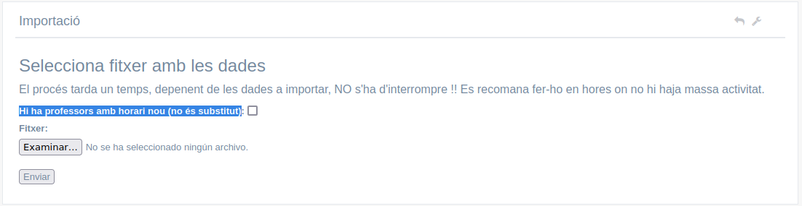

# Cóm instal·lar la intranet

## Quickstart amb Docker

Requisits: [Docker](https://docs.docker.com/engine/install/) i [Docker Compose](https://docs.docker.com/compose/install/).

```bash
# 1. Clonar el repositori
git clone https://github.com/cipfpbatoi/intranetBatoi.git
cd intranetBatoi
git checkout laravel11Legacy

# 2. Configurar l'entorn
cp .env.docker .env
# Editar .env i posar el nostre UID/GID en WWWUSER i WWWGROUP (consultar amb id -u i id -g)

# 3. Arrancar els contenidors
./vendor/bin/sail up -d
./vendor/bin/sail shell
# 4. Instal·lar dependències
php composer install
php npm install
php npm run production

# 5. Generar clau i preparar la BBDD
  php artisan key:generate
  php artisan migrate
  php artisan db:seed

# 6. (Opcional) Si hi ha problemes de permissos
sudo chown -R $USER:$USER storage bootstrap/cache && chmod -R 775 storage bootstrap/cache
```

L'aplicació estarà disponible en **<https://localhost>**. L'usuari inicial és `admin@intranet.my` amb contrasenya `12345678`.

Serveis disponibles:

| Servei     | URL                                        |
| ---------- | ------------------------------------------ |
| Intranet   | <https://localhost>                        |
| phpMyAdmin | <http://localhost:8080>                    |
| Mailpit    | <http://localhost:8025>                    |

Per a més detalls, consultar les seccions següents.

---

## Configurar la màquina

### Docker (entorn de desenvolupament)

Per a desenvolupar l'aplicació utilitzem Docker. Només cal tindre instal·lat [Docker](https://docs.docker.com/engine/install/) i [Docker Compose](https://docs.docker.com/compose/install/) a la nostra màquina.

Descarreguem el codi del repositori:

```bash
git clone https://github.com/cipfpbatoi/intranetBatoi.git
git checkout laravel11Legacy
cd intranetBatoi
```

Copiem el fitxer d'entorn preparat per a Docker:

```bash
cp .env.docker .env
```

Arranquem els contenidors:

```bash
docker compose up -d
```

Això arrancarà els següents serveis:

- **laravel.test**: contenidor principal amb PHP 8.3 i l'aplicació Laravel
- **caddy**: servidor web amb proxy invers i TLS automàtic (ports 80 i 443 en localhost)
- **mysql**: base de dades MySQL 8.0 (port 3306)
- **myadmin**: phpMyAdmin per a gestionar la BBDD (port 8080)
- **mailpit**: servidor de correu per a proves (dashboard en port 8025)

Instal·lem les dependències dins del contenidor:

```bash
docker compose exec laravel.test composer install
docker compose exec laravel.test npm install
```

Els permissos dels fitxers es gestionen automàticament pel contenidor Docker. Les variables `WWWUSER` i `WWWGROUP` del fitxer `.env.docker` s'han de configurar amb el UID i GID del nostre usuari per a evitar problemes de permissos:

```bash
# Per a saber el nostre UID i GID:
id -u    # WWWUSER
id -g    # WWWGROUP
```

Si tenim problemes de permissos amb les carpetes `storage` i `bootstrap/cache`, podem executar:

```bash
sudo chown -R $USER:$USER storage bootstrap/cache && chmod -R 775 storage bootstrap/cache
```

### Màquina nova

Si la màquina és només per a allotjar la intranet i no per a desenvolupament és millor crear nosaltres la màquina virtual o fer la instal·lació sobre una màquina real. El procediment a seguir per a instal·lar l'entorn necessario està explicat en el document [Desplegar la intranet en una nova màquina](./desplegament.md).

Per a descarregar el codi simplement anem on vullgam allotjar la intranet (p.e. _/var/www/html_), la baixem de github i descarregem les llibreries necessàries del composer:

```bash
git clone https://github.com/cipbatoi/intranetBatoi.git
composer update
```

Ens hem d'assegurar que l'usuari _www-data_ tinga permís d'escriptura en la carpeta **/storage** (per exemple posa-li el grup propietari _www-data- i dona permissos d'escriptura al grup).

## Configurar l'impressió

Si utilitzem Docker, la imatge ja inclou **wkhtmltopdf** i totes les dependències necessàries per a generar PDF.

Si instal·lem directament en una màquina (sense Docker), hem d'instal·lar els paquets **libxrender1**, **libxtst6** i **libssl1.0-dev**.
Cal configurar també en `.env`:

- `WKHTMLTOPDF_BINARY` (p. ex. `/usr/local/bin/wkhtmltopdf`)
- `WKHTMLTOIMAGE_BINARY` (p. ex. `/usr/local/bin/wkhtmltoimage`)
- `PDFTK_BINARY` (p. ex. `/usr/local/bin/pdftk`)

## Configurar la intranet

### Amb Docker

Si hem seguit els passos de la secció Docker, el fitxer `.env` ja s'ha creat a partir de `.env.docker` i ja té configurades les connexions als serveis Docker (MySQL, Mailpit, etc.). Només cal ajustar les variables `WWWUSER` i `WWWGROUP` amb el nostre UID/GID i generar la clau de l'aplicació:

```bash
docker compose exec laravel.test php artisan key:generate
```

### Sense Docker (instal·lació directa)

Configurem el fitxer d'entorn a partir de la plantilla:
```bash
cp .env.example .env
```

I editem el fitxer _.env_ modificant les variables:

```bash
APP_URL: URL de la nostra intranet, p.e. http://intranet.my
SESSION_DOMAIN: el domini de la nostra intranet (com APP_URL però sense http), p.e. intranet.my
DB_HOST: host de la base de dades
DB_DATABASE: nom de la nostra BBDD
DB_USERNAME, DB_PASSWORD: l'usuari i contrasenya per a accedir a la BBDD
```

Generem la clau de l'aplicació:

```bash
php artisan key:generate
```

El propietari de tota la carpeta i el seu contingut hauria de ser l'usuari **www-data**.

### Recarregar la configuració

Per últim només queda recarregar el fitxer de configuració en la caché (cal fer-ho cada vegada que canviem alguna cosa en qualsevol fitxer de configuració):

```bash
# Amb Docker:
docker compose exec laravel.test php artisan config:cache

# Sense Docker:
php artisan config:cache
```

## Crear la BBDD

Si utilitzem Docker, la BBDD es crea automàticament amb el `docker compose up` (base de dades `intranet` amb usuari `sail`). Només cal executar les migracions i els seeders.

Si no utilitzem Docker, creem la BBDD i li donem permissos a l'usuari configurat en el fitxer _.env_.

A continuació executem les migracions i els seeders per a crear les taules i inserir les dades inicials:

```bash
# Amb Docker:
docker compose exec laravel.test php artisan migrate
docker compose exec laravel.test php artisan db:seed

# Sense Docker:
php artisan migrate
php artisan db:seed
```

El `db:seed` fica les dades inicials de:

* menu:
* ciclos:
* horas:
* departamentos:
* tipoincidencias
Així com un usuari amb l'identificador `admin@intranet.my` i la contrasenya '12345678' que és Administrador de la intranet.

### Altres dades inicials necessarios

Les dades de les taules de _muninipios_ i _provincias_ no els obtenim de Itaca sinó que els hem de importar a ma si els volem (és opcional, s'utilitzen només en alguns llistats).

## Importar dades de Itaca

Abans de fer la primera importació de dades de Itaca hem d'obrir el fitxer **contacto.php** en _/config_ on configurem totes les dades del nostre centre. A més indicarem el NIF (en format Itaca, és a dir, amb un 0 davant) dels càrrecs així com:

* **avisos -> material**: la persona que indiquen rebrà un misstage cada vegada que es canvia d'ubicació un material inventariable
* **incidències**: ací posem a totes les persones que s'encarreguen de solventar incidències en el Centre. Són els usuaris a qui es pot asignar una incidència quan es crea.

També és convenient posar correctament les dades de les taules (això només cal fer-ho la primera vegada que es crea la intranet, la resta d'anys es conserven les dades):

* Departamentos
* Ciclos

La taula _Departamentos_ ha de tindre OBLIGATORIAMENT un departament (podem dir-li 'Desconegut' o com vulgam) amb **codi 99** que és al que s'asignaran els nous professors fins que es posen en el departament adequat.

### Primera importació

En el xml de Itaca per a la primera importació han d'estar les següents taules:
* Continguts (mòduls del centre)
* Ocupacions (codis de les ocupacions no lectives dels professors)
* Grups (grups del centre)
* Professors
* Alumnes
* Horaris grup (horaris lectius dels diferents grups)
* Horaris ocupacions (horaris no lectius dels profsesores)

Les importacions es fan des del menú **Administració -> Importació des de Itaca**. Al ser la primera cal marcar la casella '_Primera Importació anual_'.



A continuació seleccionen el fitxer amb les dades en format .XML i polsem 'Enviar'.

**ATENCIÖ: Aquest procés tardarà uns quants minuts en funció de la mida del fitxer XML. És molt important _NO TANCAR_ el navegador ni tornar a polsar '_Enviar_' fins que acabe**.

Tras importar les dades la primera vegada hurem d'assignar a ma **els professores als departaments** i **els grups als cicles** (posteriorment només haurem de tornar-ho a fer amb elo nous professors i els nous grups si hi haguera tras cada importació).

Els professors estan asignats per defecte al departament 99 ('Desconegut'). Cada professor pot posar el departament al que pertany editant el seu perfil. També des de direcció es pot posar cadascun al seu departament des de **Equip directiu -> Dades professors -> Editar perfil professor**.

Els grups por defecte no estan asignats a cap cicle. Per a fer-ho anem a **Professorat -> Gestió grups -> Editar grup** i li posem a cada grup el seu cicle.

Per a finalitzar hem de tornar a fer la importació per a que s'asignen correctament els mòduls als cicles al importar els horaris **sense la casella de 'Primera importació' MARCADA.

### Resta d'importacions

En el xml de Itaca per a la resta d'importacions només estaran les taules en que hi haja canvis, normalment:

* Alumnes per a reflectir les noves matrículas i baixes
* Profesores, si hay nuevos profesores
* Horaris grup i horaris ocupacions, si hi hagueren canvis

Marquem 'Assignar tutor' si hi ha nous tutors (si no, no cal) i deixem desmarcada la d'esborrar grups sense tutor.

Tras esperar uns minuts...

### Altres

>Si necessitem construir la imatge Docker localment (només la primera vegada o si canvia el Dockerfile):

```bash
docker compose -f docker-compose.build.yml build
```
